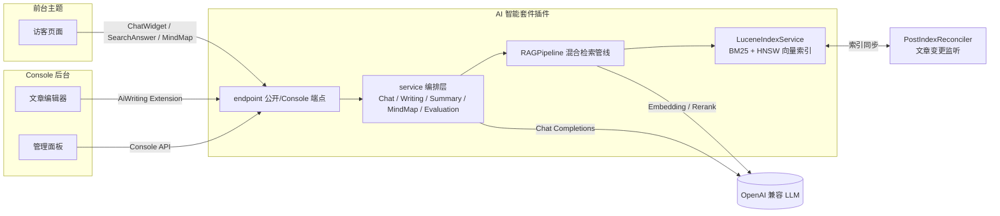
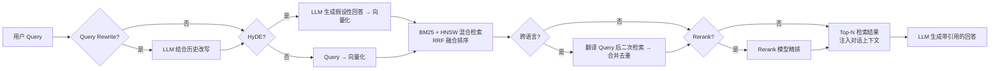

<div align="center">

# AI 智能套件 · plugin-ai-suite

为 [Halo](https://halo.run) 2.24+ 博客打造的一体化 AI 能力插件：**智能问答（RAG）· 搜索增强 · 写作辅助 · 摘要 · 脑图 · 内容缺口检测**。

对接任意 OpenAI 兼容协议的大模型（DeepSeek、通义千问、OpenAI、Moonshot、SiliconFlow、本地 Ollama……），自带混合检索引擎，无需额外数据库。

[](https://halo.run)
[](https://openjdk.org/)
[](https://vuejs.org/)
[](https://lucene.apache.org/)
[](LICENSE)
[](./plugin.yaml)

</div>

---

## ✨ 核心能力

| 访客侧（前台主题） | 管理侧（Console 后台） |
|:---|:---|
| 💬 **智能问答浮窗**：基于全站文章的 RAG 多轮对话，引用溯源 | ✍️ **AI 写作辅助**：编辑器内润色/续写/扩写/简化/译英，多轮对话式修改 |
| 🔍 **搜索 AI 综合回答**：搜索结果页流式综合回答卡片 | 📋 **文章大纲生成**：编辑器一键生成可插入结构化大纲（深度 1–3） |
| 🧠 **文章 AI 脑图**：自动生成/缓存思维导图（markmap 可视化） | 📝 **AI 摘要**：批量或单篇生成（Halo excerpt 扩展点） |
| 👍 **问答反馈**：访客点赞/点踩，回流分析 | 📚 **知识库管理**：索引状态、单篇/全量重建、切片/关键词查看 |
| | 📊 **用量统计**：按模型/日期的 token 用量与调用次数、限额 |
| | 📜 **对话日志**：全量问答记录、检索链路追踪、反馈分析 |
| | 🧪 **评测系统**：用例集 + 一键评测（命中率、回答质量多维评分） |
| | 🤖 **Agent 内容缺口检测**：基于对话日志自动分析知识盲区 |

---

## 🏗 架构总览



## 🔎 RAG 检索管线

每一步独立开关，单步超时即优雅降级，不拖垮整条链路：



---

## 🧰 技术栈

| 层 | 技术 |
|---|---|
| 后端 | Java 21 · Spring WebFlux · Halo Plugin API 2.24.0 |
| 前端 Console | Vue 3 · TypeScript · Vite · Tiptap |
| 前台 Widget | 原生 JS/CSS（通过 WebFilter 注入主题页面） |
| 检索引擎 | Apache Lucene 10.3.2（BM25 关键词 + HNSW 向量混合检索，RRF 融合） |
| 中文分词 | Lucene SmartChineseAnalyzer |
| 构建 | Gradle 9.4 · pnpm 9 · Node 20+ |

> **为什么内置 Lucene？** 复用 Halo 主程序 ClassLoader 中的 Lucene 10.3.2，避免引入外部向量数据库；`smartcn` 单独打包进插件（`transitive=false`，不重复拖入 `lucene-core`）。详见 [build.gradle](build.gradle)。

---

## 🚀 快速开始

### 环境要求

- Halo ≥ 2.24.0
- 一个 OpenAI 兼容的 LLM 服务（支持 Chat + Embedding，Rerank / Query Rewrite 可选）

### 安装

**方式一：下载预构建产物**

从 [Releases](https://github.com/rainwu/plugin-ai-suite/releases) 下载 `plugin-ai-suite-*.jar`，在 Halo 后台「插件管理 → 安装 → 上传 jar」即可。

**方式二：源码构建**（需 JDK 21）

```bash
git clone https://github.com/rainwu/plugin-ai-suite.git
cd plugin-ai-suite
JAVA_HOME=/path/to/jdk21 ./gradlew build
# 产物：build/libs/plugin-ai-suite-<version>.jar
```

然后在 Halo 后台上传产物并启用。

### 首次配置

启用后进入「AI 智能套件」配置页：

1. **模型配置** — 填写 Base URL / API Key / 模型名（Chat、Embedding 必填）
2. **知识库** — 点击「全量重建」，将已发布文章切片并向量化入库
3. **检索增强** — 按需调整 Top-K、相似度阈值、HyDE、Rerank
4. **对话与外观** — 系统提示词、浮窗主题色、访客开关
5. **用量限制** — 每日 token 限额（按模型）、访客 IP 限流、白名单

完成后即可在博客前台看到 AI 浮窗。

> 📸 *截图位（待补）*：`docs/screenshots/config.png` · `docs/screenshots/widget.png` · `docs/screenshots/writing.png`

---

## ⚙️ 配置项一览

配置存储在 ConfigMap `ai-suite-configmap`，API Key 单独加密存储在 Secret `ai-suite-api-keys`。下表为主要可调项（默认值见 [AIProperties.java](src/main/java/run/halo/ai/suite/config/AIProperties.java)）：

| 分组 | 关键项 | 说明 |
|---|---|---|
| **models** | `chatBaseUrl` / `chatModel` | 对话模型；兼容任意 OpenAI 协议厂商 |
| | `embeddingModel` / `embeddingDimensions` | 向量化模型（默认维度 1024） |
| | `rerankEnabled` / `rerankModel` | 可选 Rerank 精排 |
| | `queryRewriteEnabled` / `queryRewriteModel` | 可选 LLM 查询改写 |
| **chunking** | `chunkSize` / `chunkOverlap` | 切片大小 / 重叠（默认 500 / 50） |
| | `markdownHeadingAware` / `sentenceAware` | 标题/句子边界感知切片 |
| | `autoKeywords` / `autoKeywordsCount` | LLM 自动提取关键词增强召回 |
| **retrieval** | `searchMode` | `hybrid`（默认）/ `bm25` / `semantic` |
| | `topK` / `topN` | 召回数 / 最终返回数（默认 20 / 5） |
| | `similarityThreshold` | 相似度阈值（默认 0.5） |
| | `noMatchBehavior` | 无匹配时 `continue` / `reply` |
| **enhancement** | `hydeEnabled` / `rerankToggle` / `crossLanguageEnabled` | HyDE / 精排 / 跨语言检索开关 |
| **chat** | `systemPrompt` / `temperature` / `historyTurns` | 对话提示词、温度、历史轮数 |
| | `widgetThemeColor` / `widgetTheme` / `widgetPosition` | 浮窗外观与位置 |
| | `allowGuest` / `showPrivacyTip` | 访客开关、隐私提示 |
| **writing** | `outlineDepth`（1–3）/ `outlineNumbering` | 大纲深度与编号方式 |
| | `maxInputLength`（默认 6000） | 写作输入字符上限（超限即报错，不静默截断） |
| **excerpt** | `maxLength` / `temperature`（默认 0.3） | 摘要长度与温度 |
| **mindmap** | `maxDepth`（2–4）/ `maxInputLength` | 脑图深度与输入上限 |
| **search** | `enabled` / `showAiAnswer` / `resultCount` | 搜索 AI 综合回答开关 |
| **usageLimits** | `chatModelLimits` / `visitor.{dailyLimit,hourlyLimit,whitelist}` | Token 与访客 IP 限额 |

---

## 📡 HTTP API

所有端点统一以 `api.ai-suite.halo.run/v1alpha1`（访客）或 `console.api.ai-suite.halo.run/v1alpha1`（后台）为前缀。

### 访客端（匿名 RoleTemplate 授权）

| 路径 | 方法 | 说明 |
|---|---|---|
| `/apis/api.ai-suite.halo.run/v1alpha1/chat` | GET / POST | 非流式对话 |
| `/apis/api.ai-suite.halo.run/v1alpha1/chat/stream` | GET / POST | SSE 流式对话 |
| `/apis/api.ai-suite.halo.run/v1alpha1/chat/feedback` | GET / POST | 问答点赞/点踩反馈 |
| `/apis/api.ai-suite.halo.run/v1alpha1/widget-config` | GET | 浮窗外观配置 |
| `/apis/api.ai-suite.halo.run/v1alpha1/search/answer` | GET | 搜索页 AI 综合回答（SSE） |
| `/apis/api.ai-suite.halo.run/v1alpha1/search/results` | GET | 搜索结果（兼容 `/search/halo-results`） |
| `/apis/api.ai-suite.halo.run/v1alpha1/mindmap` | GET | 文章脑图缓存读取 |

### Console 端（需管理员）

| 模块 | 代表路径 | 说明 |
|---|---|---|
| 配置 | `/config` · `/config/save` · `/config/test-connection` · `/config/test-{embedding,rerank,query-rewrite}` | 配置读写与连通性测试 |
| 调试 | `/chat/debug/stream` | 带检索链路追踪的调试对话（SSE） |
| 写作 | `/writing/assist` · `/writing/assist/stream` | 非流式 / SSE 流式写作辅助 |
| 知识库 | `/knowledge/reindex` · `/knowledge/articles` · `/knowledge/articles/{name}/chunks` · `/knowledge/excerpts/*` | 索引重建、切片查看、摘要管理 |
| 脑图 | `/mindmap/generate` · `/mindmap/batch-generate` · `/mindmap/jobs/{jobId}` | 脑图生成与批量任务 |
| 用量 | `/usage/today` · `/usage/stats` · `/usage/calls` · `/usage/limits` | 用量统计与限额 |
| 对话日志 | `/chat-logs` · `/chat-logs/{id}` · `/chat-logs/stats` · `/chat-logs/clear` | 问答日志查询 |
| 评测 | `/evaluations/datasets` · `/evaluations/run` · `/evaluations/runs/{runId}/status` | 评测集与一键评测 |
| Agent | `/agent/content-gap/run` · `/agent/tasks` · `/agent/tasks/{taskId}` | 内容缺口检测 |

**SSE 协议**（流式接口）：

```
data: <token>            # 增量 token
data: [DONE]             # 流结束
event: error\n data: msg # 错误（其后仍跟 [DONE]）
```

---

## 🔐 安全与限流

- **API Key 加密**：存于 Halo Secret（非 ConfigMap 明文）；从旧版 `ai-assistant` 升级时存量 Key 自动迁移。
- **Token 限额**：按模型设每日 token 上限，采用「预扣对账」机制（reserve/settle）防止并发绕过。
- **访客限流**：按 IP 的每日 + 每小时滑动窗口；hourly 超限时回退 daily 计数避免误封；支持白名单。
- **功能开关前置校验**：访客端点在调用前校验开关，关闭后匿名调用直接拒绝。
- **SSRF 防护**：LLM Base URL 校验禁止指向内网 / 本机 / 云元数据地址。
- **错误脱敏**：LLM 错误信息抹除疑似 API Key 的敏感片段，避免泄漏到日志。

---

## 🗂 项目结构

```
src/main/java/run/halo/ai/suite/
├── AISuitePlugin.java            # 插件主类
├── config/                       # 配置读取、API Key 迁移（AIProperties）
├── llm/                          # 统一 LLM 客户端（OpenAI 兼容）+ 用量场景
├── rag/                          # 混合检索（BM25 + HNSW + RRF + Rerank）
│   ├── RAGPipeline.java          # 管线编排（HyDE / 改写 / 跨语言 / 精排）
│   ├── HybridRetriever.java      # 混合检索器
│   ├── LuceneIndexService.java   # 索引管理
│   └── DocumentChunker.java      # 文章切片
├── service/                      # 对话/写作/摘要/脑图/评测/日志服务
├── endpoint/                     # 公开 + Console HTTP 端点
├── widget/                       # 前台浮窗注入（AdditionalWebFilter）
├── state/                        # 用量统计、访客限流
├── agent/                        # Agent 内容缺口检测
├── extension/                    # GVK 数据模型（ChatLog / 评测 / Agent 任务）
└── listener/                     # 文章变更 → 索引同步（PostIndexReconciler）

ui/                               # Console 管理端（Vue 3）
├── src/views/                    # 各管理页面
└── src/extensions/ai-writing/    # 编辑器 AI 写作扩展（Tiptap）

src/main/resources/
├── plugin.yaml                   # 插件清单
├── extensions/                   # 角色模板、扩展点注册、反向代理
└── static/                       # 前台 widget JS/CSS
```

---

## 🛠 开发

```bash
# 前端开发（watch 模式）
cd ui && pnpm dev

# 后端 + 前端完整构建（必须 JDK 21）
JAVA_HOME=/path/to/jdk21 ./gradlew build

# 运行测试（当前 74 个，覆盖检索/分词/LLM/限流等核心算法）
JAVA_HOME=/path/to/jdk21 ./gradlew test
```

> **不使用 `./gradlew haloServer`**（依赖 Docker）。开发时直接以 jar 方式运行 Halo 并热部署插件，详见 [AGENTS.md](AGENTS.md)。

### 兼容厂商示例

| 厂商 | Base URL | 备注 |
|---|---|---|
| DeepSeek | `https://api.deepseek.com/v1` | 对话性价比高 |
| 通义千问 | `https://dashscope.aliyuncs.com/compatible-mode/v1` | Embedding 推荐 |
| SiliconFlow | `https://api.siliconflow.cn/v1` | 提供 Rerank 模型 |
| OpenAI | `https://api.openai.com/v1` | 原生兼容 |
| 本地 Ollama | `http://localhost:11434/v1` | 注意 SSRF 校验会拦截 localhost，需放白名单 |

> Base URL 已含 `/v1` 时无需补；不含则自动追加。

---

## ❓ 常见问题

**Q：升级插件后检索不工作了？**
A：Lucene 版本必须与 Halo 内置版本严格对齐（当前 10.3.2）。跨 ClassLoader 会触发 Codec SPI 类型不一致错误；若更换 Halo 大版本，需同步更新本插件依赖。

**Q：API Key 在哪存？会泄露吗？**
A：存于 Halo Secret；LLM 错误信息会脱敏（抹除疑似 Key 片段）后再写日志。

**Q：访客被限流了怎么办？**
A：检查「用量限制 → 访客限流」的每日/每小时限额与白名单；hourly 超限会回退 daily 计数。

**Q：AI 写作输入太长报错？**
A：写作输入硬上限 6000 字符，超过会返回错误事件而非静默截断。请在编辑器内分段处理。

**Q：支持非 OpenAI 协议的模型吗？**
A：不支持。仅兼容标准 OpenAI Chat/Embedding 协议，通过 baseUrl 切换厂商。

---

## 📄 许可证

[GPL-3.0](LICENSE)

<div align="center">

<sub>由 AI 智能套件为 Halo 社区打造 · 欢迎提 Issue / PR</sub>

</div>
