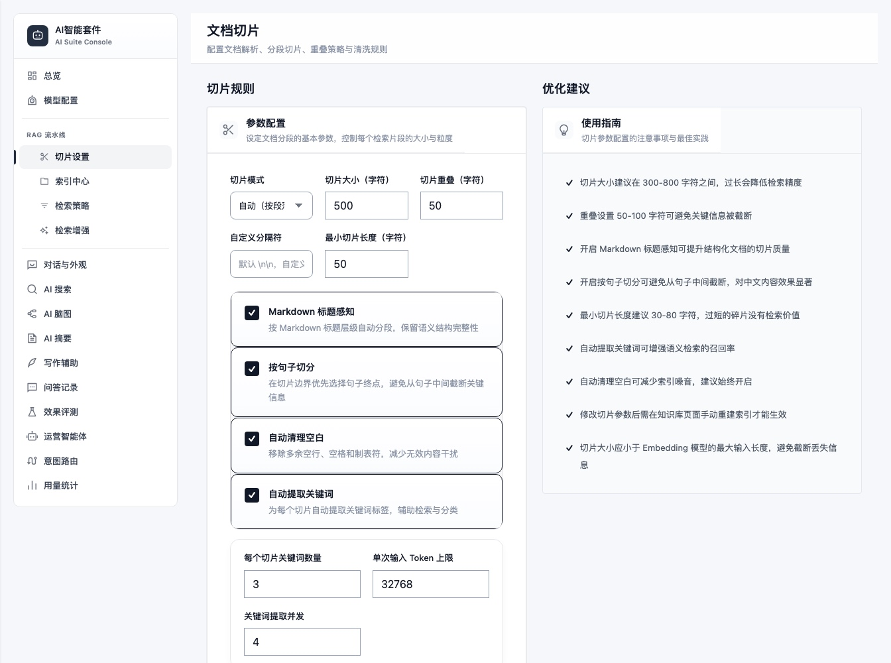
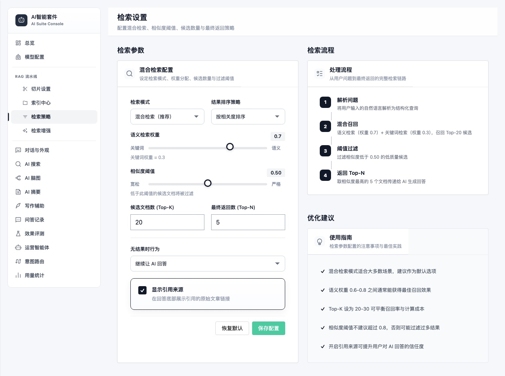
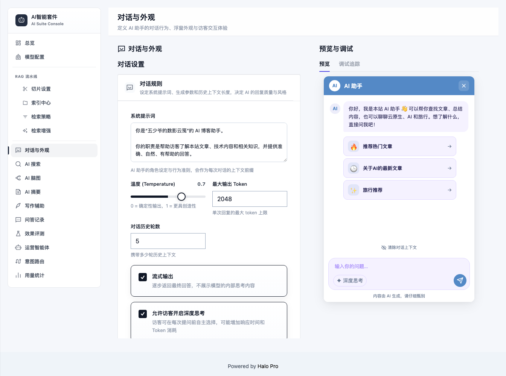
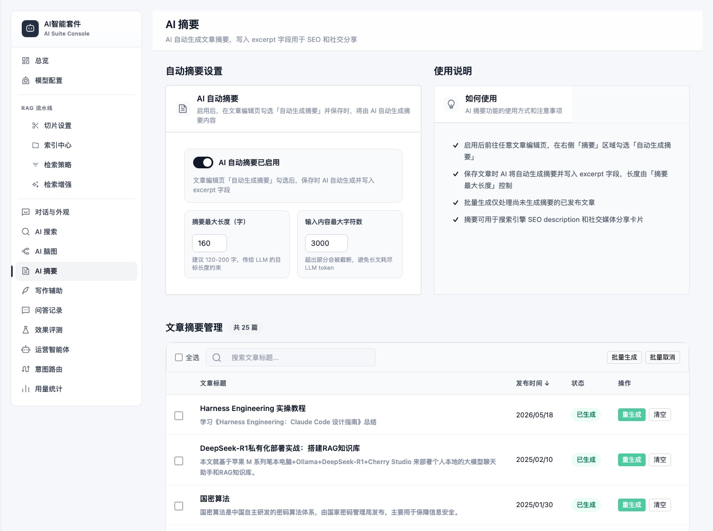
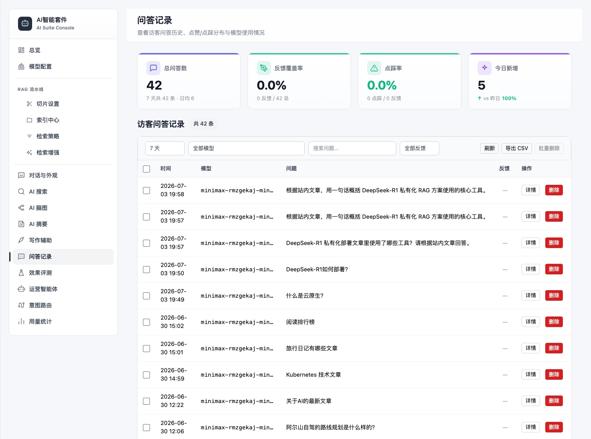

<div align="center">

# AI 智能套件

**把 Halo 博客变成一个能回答、会检索、可辅助创作，也懂内容运营的 AI 知识站。**

面向 Halo 2.25+ 的一体化 AI 插件，提供 RAG 智能问答、AI 搜索、写作辅助、摘要、脑图、效果评测、意图路由与运营智能体。基于 Halo AI Foundation 统一管理模型能力，内置 Lucene 混合检索，无需额外部署向量数据库。

[](https://halo.run)
[](https://openjdk.org/)
[](https://vuejs.org/)
[](https://lucene.apache.org/)
[](src/main/resources/plugin.yaml)
[](LICENSE)

[快速开始](#快速开始) · [功能全景](#功能全景) · [完整文档](https://ai-suite-docs.rainwu.cn) · [工作原理](#工作原理) · [开发指南](#开发指南)

</div>

[](assets/readme/ai-suite-hero.svg)

---

## 项目文档

- 在线文档：[AI 智能套件文档中心](https://ai-suite-docs.rainwu.cn)
- 文档源码：[docs/](docs/)

## 它解决什么问题

博客通常不缺内容，缺的是让内容被重新发现、准确回答和持续复用的能力。AI 智能套件围绕文章从生产到消费的完整链路工作：

- **访客找答案**：基于站内文章进行多轮问答，回答附带原文引用；支持访客按次开启深度思考并折叠查看推理过程。
- **搜索更直接**：在关键词结果之外，先给出一段可追溯的 AI 综合回答。
- **作者写得更快**：在 Halo 编辑器内完成润色、续写、扩写、简化、翻译和大纲生成。
- **内容更易理解**：自动生成文章摘要与可交互脑图。
- **运营有依据**：从真实访客问题中发现内容缺口，形成选题、大纲和旧文优化建议。
- **高频问题走捷径**：用可配置的意图路由处理“最新文章”“热门内容”“某标签文章”等确定性请求，并可用自然语言生成、检查和模拟路由草稿。

> 需要完整的安装、配置、运维、架构和 API 说明？进入 [AI 智能套件文档中心](https://ai-suite-docs.rainwu.cn)。

## 功能全景

| 面向访客 | 面向作者与运营者 |
| --- | --- |
| **RAG 智能问答**：全站文章多轮对话、深度思考、流式输出、引用溯源 | **写作辅助**：润色、续写、扩写、简化、译英，多轮追加要求并一键应用 |
| **AI 搜索**：搜索页生成综合回答，并保留关键词结果 | **AI 摘要**：单篇或批量生成 Halo 文章摘要 |
| **文章脑图**：自动生成并缓存可交互思维导图 | **索引中心**：全量/单篇重建，查看切片、关键词与索引状态 |
| **问答反馈**：点赞、点踩结果进入后台分析 | **效果评测**：维护评测集，检查检索命中、回答质量与引用效果 |
| **意图路由**：确定性问题进入可编排 Pipeline，响应更稳定 | **运营智能体**：分析访客需求与文章覆盖，产出可执行的内容建议 |
| **主题无关注入**：原生 JS/CSS Widget 接入 Halo 前台 | **用量与审计**：模型 token、调用记录、失败率、限额与检索链路追踪 |

> 插件依赖 Halo AI Foundation 提供模型能力。AI 搜索的检索能力由本插件提供；页面搜索按钮则依赖主题、官方搜索插件或自定义入口，未提供按钮时仍可通过快捷键唤起。

### 意图路由

意图路由适合处理不需要语义检索、但需要读取站内实时数据的问题。例如：

```text
“最近更新了哪些 AI 文章？”
        ↓ 命中 builtin-latest-posts
主题匹配 → 发布时间倒序 → 确定性导语 + 结构化文章卡片
```

后台可以配置触发规则、优先级和处理步骤，也可以在“AI 创建”中直接描述业务目标，由模型生成受约束的草稿。插件内置 `TOPIC_MATCH`、`LLM_TITLE_FILTER`、`TAG_MATCH`、`CATEGORY_MATCH`、`KEYWORD_MATCH`、`TIME_SORT`、`VISIT_SORT` 七类处理器；未命中意图时自动回到正常 RAG 流程。

## 实际界面

以下截图来自 `dev.rainwu.cn` 测试环境，展示当前版本的真实运行效果。站点内容、统计数字和界面细节会随数据与版本变化。

### 访客端

#### RAG 智能问答

[](assets/readme/screenshots/visitor-chat.jpg)

基于博客内容回答，展示文章引用与反馈操作。

#### 文章 AI 脑图

<p align="center">
  <a href="assets/readme/screenshots/visitor-mindmap.jpg"></a>
</p>

<p align="center"><sub>聚焦显示文章结构，支持节点折叠、展开与原文跳转。</sub></p>

### Console 管理端

| 总览 | 模型配置 |
| --- | --- |
| [](assets/readme/screenshots/console-dashboard.jpg) | [](assets/readme/screenshots/console-models.jpg) |
| 汇总索引、访客问答与常用操作状态 | 选择并测试对话、Embedding、Rerank 与查询改写模型 |

| 切片设置 | 检索策略 |
| --- | --- |
| [](assets/readme/screenshots/console-chunking.jpg) | [](assets/readme/screenshots/console-retrieval.jpg) |
| 配置切片大小、重叠、标题感知与内容清洗 | 调整混合检索权重、候选数量、阈值与排序策略 |

| 索引中心 | 意图路由 |
| --- | --- |
| [](assets/readme/screenshots/console-knowledge.jpg) | [](assets/readme/screenshots/console-intent-routes.jpg) |
| 查看索引健康度、切片、关键词覆盖与维护建议 | 管理触发词、处理器 Pipeline、优先级与启用状态 |

| 检索增强 | AI 搜索 |
| --- | --- |
| [](assets/readme/screenshots/console-enhance.jpg) | [](assets/readme/screenshots/console-search.jpg) |
| 配置 Query Rewrite、HyDE、Rerank 与跨语言检索 | 调整回答策略、界面主题，并实时预览搜索卡片 |

| 对话与外观 | AI 脑图 |
| --- | --- |
| [](assets/readme/screenshots/console-chat.png) | [](assets/readme/screenshots/console-mindmap.jpg) |
| 配置问答规则、快捷问题、访客浮窗并实时预览 | 设置生成参数、独立主题，并管理文章脑图 |

| AI 摘要 | 写作辅助 |
| --- | --- |
| [](assets/readme/screenshots/console-excerpt.jpg) | [](assets/readme/screenshots/console-writing.jpg) |
| 配置摘要生成参数并批量管理文章摘要 | 配置编辑器 AI 动作、写作模型与大纲生成 |

| 问答记录 | 用量统计 |
| --- | --- |
| [](assets/readme/screenshots/console-chat-logs.jpg) | [](assets/readme/screenshots/console-usage.jpg) |
| 查看问答明细、反馈分布与模型使用情况 | 分析调用次数、Token、失败率、场景和模型消耗 |

| 效果评测 | 运营智能体 |
| --- | --- |
| [](assets/readme/screenshots/console-evaluation.jpg) | [](assets/readme/screenshots/console-agent.jpg) |
| 管理评测集、运行范围与回答质量指标 | 分析站内内容缺口，生成选题与旧文更新建议 |

## 快速开始

### 环境要求

- Halo 2.25.0 或更高版本
- 已安装并配置 Halo AI Foundation 插件
- Chat 模型与 Embedding 模型为必需；Rerank、Query Rewrite 模型可选

> Embedding 模型决定索引向量维度。更换模型或维度后，请在「索引中心」执行全量重建。

### 1. 安装插件

从 [Releases](https://gitlab.rainwu.cn/rainwu/halo-plugin-ai-suite/-/releases) 下载 `plugin-ai-suite-*.jar`，然后在 Halo Console 中进入「插件 → 安装」，上传并启用。

也可以使用 JDK 21 从源码构建：

```bash
git clone https://gitlab.rainwu.cn/rainwu/halo-plugin-ai-suite.git
cd halo-plugin-ai-suite
JAVA_HOME=/path/to/jdk21 ./gradlew build
```

构建产物位于 `build/libs/`。

### 2. 配置模型

进入「AI 智能套件 → 模型配置」：

1. 先在 Halo AI Foundation 中配置模型供应商、密钥和默认模型。
2. 在 AI 智能套件中选择或填写 Chat、Embedding、Rerank、Query Rewrite 等 AI Foundation 模型资源名。
3. 分别执行连通性测试，确认配置可用。
4. 确认 Embedding 模型向量维度后，进入「索引中心」重建索引。

模型供应商、Base URL、API Key 和默认模型均由 Halo AI Foundation 统一维护。AI 智能套件只保存各业务使用的模型资源名与生成参数。

### 3. 建立文章索引

进入「索引中心」，点击「全量重建」。插件会读取已发布的公开文章，完成清洗、切片、关键词提取与向量化。

索引完成后，可先在「对话与外观」中调试问答和检索链路，再开启访客浮窗、AI 搜索或文章脑图。

### 4. 配置生产环境的 SSE

智能问答、AI 搜索和写作辅助使用 SSE 流式输出。如果 Halo 前面有 Nginx，请在代理 Halo 的 `location` 中关闭缓冲：

```nginx
location / {
    proxy_pass http://127.0.0.1:8090;

    proxy_set_header Host $host;
    proxy_set_header X-Real-IP $remote_addr;
    proxy_set_header X-Forwarded-For $proxy_add_x_forwarded_for;
    proxy_set_header X-Forwarded-Proto $scheme;

    proxy_http_version 1.1;
    proxy_set_header Connection "";
    proxy_buffering off;
    proxy_cache off;
    proxy_read_timeout 300s;
}
```

`proxy_buffering off` 是流式输出的关键；`X-Real-IP` 和 `X-Forwarded-For` 用于访客限流和日志记录。如果前面还有 CDN 或 WAF，也需要确认它们不会缓冲 SSE 响应。

访客聊天浮窗通过 `POST /chat/stream` 在请求体中传递问题和对话历史，AI 搜索回答通过 `POST /search/answer` 传递关键词。两者都不依赖放宽 Halo Netty 的 HTTP 请求行长度，可以移除 `SERVER_NETTY_MAX_INITIAL_LINE_LENGTH=64KB`。请求头大小与对话历史无关，可按站点 Cookie 和代理头的实际规模决定是否保留 `SERVER_MAX_HTTP_REQUEST_HEADER_SIZE`。

## 工作原理

### 系统全景架构

主图采用“体验入口 → API 与权限边界 → 业务能力 → AI 编排核心 → 共享基础能力 → 数据与知识”的阅读路径，并单独展示 Halo AI Foundation 到外部模型能力的调用边界。蓝色表示业务调用，紫色表示模型调用，绿色表示数据流；具体类级调用继续由下方专项图展开。

[](assets/readme/system-architecture.svg)

<details>
<summary><strong>查看插件内部组件映射</strong></summary>

| 架构区域 | 核心实现 |
| --- | --- |
| 前台体验 | `ChatWidgetFilter`、`PublicChatEndpoint`、`PublicSearchEndpoint`、`SearchAnswerEndpoint`、`PublicMindMapEndpoint` |
| Console 与编辑器 | Vue 管理页面、`AiWritingExtension`、Console 系列 Endpoint |
| AI 编排核心 | `ChatService`、`IntentDetector`、`PipelineExecutor`、`RAGPipeline`、`AiFoundationClient`、`LlmClient` |
| 检索与索引 | `DocumentChunker`、`HybridRetriever`、`LuceneIndexService`、`PostIndexReconciler` |
| 内容与运营 | `WritingService`、`SummaryService`、`MindMapService`、`EvaluationService`、`ContentGapAgentService` |
| 安全与观测 | `LimitGuard`、`VisitorRateLimiter`、`UsageTracker`、`ChatLogger`、`PipelineTrace`、`TraceCache` |
| Halo 数据 | Post / Tag / Category / Counter、ConfigMap、自定义 Extension、AI Foundation 模型配置 |

</details>

### 一次访客问答如何流转

意图路由和 RAG 共用同一套公开 API、SSE 协议、引用结构与问答日志。意图路径直接返回确定性导语和可信文章卡片；未命中时才进入 RAG，并通过 Halo AI Foundation 流式生成回答。

[](assets/readme/visitor-chat-sequence.svg)

### RAG 检索管线

管线同时考虑了增强效果与失败降级。Query Rewrite、HyDE、跨语言检索和 Rerank 都可以独立关闭；单步超时不会拖死整条链路，调用侧还有 15 秒的整体兜底。

[](assets/readme/rag-pipeline.svg)

### 数据、索引与状态

数据按生命周期分为四类：Halo 数据库保存文章和自定义 Extension，ConfigMap 保存套件配置与用量历史，Lucene 文件保存可重建的切片和向量索引，JVM 内存保存限流窗口、TraceCache 与活动任务状态。用量当日在内存累计并异步刷入 ConfigMap，不能把短期运行状态当成业务备份。

[](assets/readme/data-index-state.svg)

### 为什么不需要外部向量数据库

插件直接使用与 Halo 2.25.0 对齐的 Lucene 10.3.2：BM25 负责关键词召回，HNSW 负责向量召回，再通过 RRF 融合结果。索引保存在 Halo 数据目录中，适合个人博客和中小型内容站点的一体化部署。

> Lucene 版本必须与 Halo 内置版本严格一致。核心依赖使用 `compileOnly` 复用 Halo ClassLoader，SmartChineseAnalyzer 单独打包且不传递引入 `lucene-core`。

## 配置导航

| Console 页面 | 主要用途 |
| --- | --- |
| 模型配置 | Chat、Embedding、Rerank、Query Rewrite 模型与连通性测试 |
| 切片设置 | 切片大小、重叠、标题/句子边界与自动关键词 |
| 索引中心 | 索引重建、文章状态、切片与关键词检查 |
| 检索策略 / 检索增强 | BM25/向量混合检索、Top-K、阈值、HyDE、Rerank、跨语言 |
| 对话与外观 | 系统提示词、历史轮数、访客开关与浮窗样式 |
| AI 搜索 / AI 脑图 / AI 摘要 | 各前台与内容生成功能的开关和参数 |
| 写作辅助 | 编辑器写作模型、大纲深度与输入限制 |
| 意图路由 | 触发规则、Pipeline、优先级与输出模板 |
| 效果评测 | 评测数据集、运行记录和质量问题定位 |
| 运营智能体 | 内容缺口、选题、大纲与旧文更新建议 |
| 问答记录 / 用量统计 | 会话、反馈、调用明细、token 和限额 |

“对话与外观”还负责深度思考策略和结构化快捷问题。快捷问题可以直接绑定已启用的意图路由，避免依赖文案模糊匹配。

## 0.3.2 文档重点

- [当前版本能力清单](docs/reference/current-version.md)
- [深度思考与推理过程](docs/user-guide/reasoning-mode.md)
- [AI 创建与管理意图路由](docs/user-guide/intent-routing.md)
- [Public API 与 v1alpha2 兼容入口](docs/api/public-api.md)

配置保存在 ConfigMap `ai-suite-configmap`。模型供应商、Base URL、API Key 和默认模型由 Halo AI Foundation 保存和管理。

## 安全与稳定性

- **密钥托管**：模型密钥由 Halo AI Foundation 统一管理，AI 智能套件不再读取或保存模型 API Key。
- **调用限额**：支持按模型设置每日 token 上限，并通过预扣与对账降低并发超额风险。
- **访客限流**：支持按 IP 的每小时、每日限制和白名单。
- **访问控制**：公开 API 使用独立匿名 RoleTemplate；Console API 需要管理员权限。
- **可观测性**：记录检索阶段、耗时、引用、命中意图、模型用量和访客反馈。

## 技术栈

| 层 | 技术 |
| --- | --- |
| 插件后端 | Java 21、Spring WebFlux、Halo Plugin API 2.24.0 编译基线（运行要求 Halo 2.25+） |
| Console | Vue 3、TypeScript、Vite、Tiptap |
| 主题侧 | 原生 JavaScript / CSS，通过 AdditionalWebFilter 注入 |
| 检索 | Apache Lucene 10.3.2、BM25、HNSW、RRF、SmartChineseAnalyzer |
| 构建 | Gradle 9.4、Node.js 20+、pnpm 9+ |

## 项目结构

```text
src/main/java/run/halo/ai/suite/
├── agent/          # 运营智能体任务
├── config/         # 配置读取
├── endpoint/       # 公开 API 与 Console API
├── extension/      # ChatLog、评测、意图路由、Agent 任务等 GVK
├── intent/         # 意图 Pipeline 与内置处理器
├── listener/       # 文章变更与索引同步
├── llm/            # AI Foundation 适配客户端与用量场景
├── rag/            # 切片、BM25/HNSW 检索与 RAG 编排
├── service/        # 对话、写作、摘要、脑图、评测等服务
├── state/          # 用量统计与限流
└── widget/         # 前台资源注入

ui/src/
├── extensions/ai-writing/  # Tiptap AI 写作扩展
├── views/                  # Console 管理页面
├── components/             # 通用 UI 组件
└── utils/                  # API 与工具函数

src/main/resources/
├── extensions/     # RoleTemplate、扩展点与静态资源代理
├── static/         # 前台 Widget JS / CSS
└── plugin.yaml     # Halo 插件清单
```

## 开发指南

本项目要求 JDK 21，不使用 Docker，也不要运行 `./gradlew haloServer`。

```bash
# 完整构建：后端 + Console
JAVA_HOME=~/jdk21/contents/Contents/Home ./gradlew build

# 仅构建后端 jar
JAVA_HOME=~/jdk21/contents/Contents/Home ./gradlew jar

# 运行后端测试
JAVA_HOME=~/jdk21/contents/Contents/Home ./gradlew test

# Console 前端 watch 模式
cd ui && pnpm dev
```

### 本地联调

仓库提供了开发脚本，会构建插件、检查 8090 端口并以 jar 方式运行 Halo：

```bash
./dev-start.sh
```

仅重新构建并部署插件：

```bash
./dev-start.sh --deploy-only
```

本地地址为 `http://localhost:8090`，Halo 必须从 `dev/` 目录启动，因为开发配置位于 `dev/application.yaml`。

## 常见问题

<details>
<summary><strong>回答不是流式出现，而是最后一次性显示？</strong></summary>

通常是 Nginx、CDN 或 WAF 缓冲了 SSE 响应。先确认 Halo 代理配置包含 `proxy_buffering off`，再检查上游 CDN 的缓存和响应优化策略。

</details>

<details>
<summary><strong>更换 Embedding 模型后搜索结果异常？</strong></summary>

确认新模型的向量维度与配置一致，然后执行一次全量索引重建。旧向量不能直接与不同模型或不同维度的新向量混用。

</details>

<details>
<summary><strong>如何接入本地 Ollama？</strong></summary>

请先在 Halo AI Foundation 中配置可访问的 Ollama 兼容服务。AI 智能套件不直接保存模型 Base URL 或 API Key，只引用 AI Foundation 中的模型资源。

</details>

<details>
<summary><strong>升级 Halo 后插件无法加载 Lucene 索引？</strong></summary>

插件依赖的 Lucene 版本必须与 Halo 内置版本一致。升级 Halo 大版本前，请先确认本插件发布版本声明的兼容范围。

</details>

## 许可证

本项目基于 [GPL-3.0](LICENSE) 发布。欢迎提交 Issue 和 Pull Request。

<div align="center">

<sub>让博客里的内容继续工作，而不只是静静躺在归档页里。</sub>

</div>
