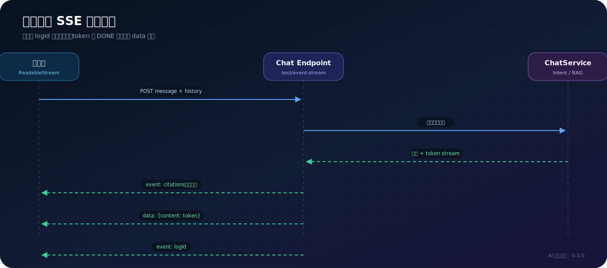
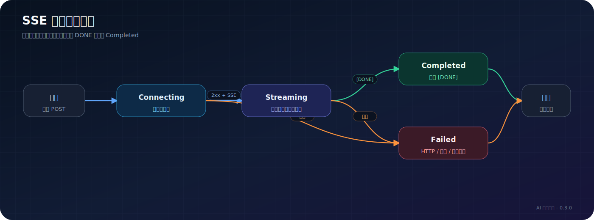

# SSE 流式协议

> 适用读者：Widget 开发者、API 调用方、代理运维人员  
> API 前缀：`/apis/api.ai-suite.halo.run/v1alpha1`

## 使用 SSE 的接口

| 接口 | 方法 | 认证 | 说明 |
| --- | --- | --- | --- |
| `/chat/stream` | POST | 匿名 | 访客流式问答 |
| `/search/answer` | POST | 匿名 | 搜索页 AI 综合回答 |
| `/apis/console.api.ai-suite.halo.run/v1alpha1/writing/assist/stream` | POST | 管理员 | 编辑器写作辅助 |

公开聊天和搜索使用 `fetch` 发送 POST JSON，再通过 `ReadableStream` 解析响应，不使用只能发送 GET 的 `EventSource`。

## 访客聊天请求

```http
POST /apis/api.ai-suite.halo.run/v1alpha1/chat/stream
Content-Type: application/json
Accept: text/event-stream
```

```json
{
  "message": "站内有哪些关于 AI 的文章？",
  "history": [
    { "role": "user", "content": "你好" },
    { "role": "assistant", "content": "你好，有什么可以帮你？" }
  ]
}
```

限制：当前消息最多 4000 字符，历史最多 20 项，每项内容最多 4000 字符。

## 搜索回答请求

```http
POST /apis/api.ai-suite.halo.run/v1alpha1/search/answer
Content-Type: application/json
Accept: text/event-stream
```

```json
{
  "keyword": "Halo 插件开发"
}
```

搜索关键词最多 500 字符。

## 聊天事件顺序



### citations

```text
event:citations
data:[{"title":"文章标题","postId":"post-name","url":"/archives/..."}]
```

引用事件只在存在引用时发送。客户端不能假设第一帧一定是 citations。

### token

```text
data:{"content":"回答片段"}
```

token 使用 JSON 包装以保留前后空格和换行。客户端应解析 JSON 后拼接 `content`，不要直接把整个 `data:` 内容追加到页面。

### logId

```text
event:logId
data:550e8400-e29b-41d4-a716-446655440000
```

`logId` 用于后续点赞、点踩和 Trace 回溯。搜索回答当前不发送 `logId`。

### DONE

```text
data:[DONE]
```

收到 `[DONE]` 后结束本轮解析并恢复输入状态。网络关闭不能完全替代 DONE，因为错误路径也会尽量发送友好提示和 DONE。

## 错误行为

公开 SSE 为了让前端保持统一解析，部分业务错误仍可能以 HTTP 200 返回，并在 token 中发送友好错误消息，随后发送 `[DONE]`。

```text
data:{"content":"AI 搜索暂不可用"}

data:[DONE]
```

调用方需要同时处理：

- 非 2xx HTTP 状态。
- SSE 中的错误文本或 `event:error`。
- 连接提前关闭。
- 长时间没有数据的超时。
- 正常 `[DONE]`。

## 客户端解析状态机



## curl 验证

```bash
curl -N -X POST \
  'http://127.0.0.1:8090/apis/api.ai-suite.halo.run/v1alpha1/chat/stream' \
  -H 'Content-Type: application/json' \
  --data '{"message":"介绍一下站内内容","history":[]}'
```

生产域名和 8090 直连结果的到达节奏不同，通常意味着代理缓冲。配置方法见 [生产部署](../operations/production-deployment.md)。

## 反馈接口

聊天完成后可使用 `logId` 提交反馈：

```http
POST /apis/api.ai-suite.halo.run/v1alpha1/chat/feedback?logId=...&type=like&comment=...
```

为兼容旧前端，目前反馈接口同时保留 GET 和 POST；新调用方应优先使用 POST。
