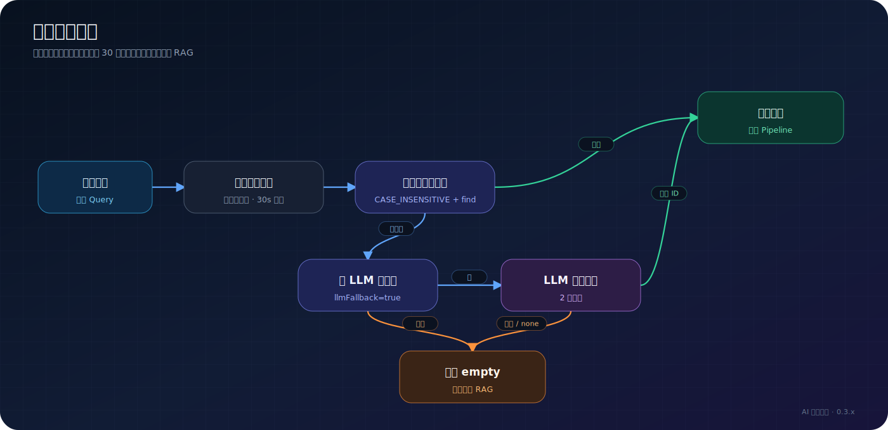
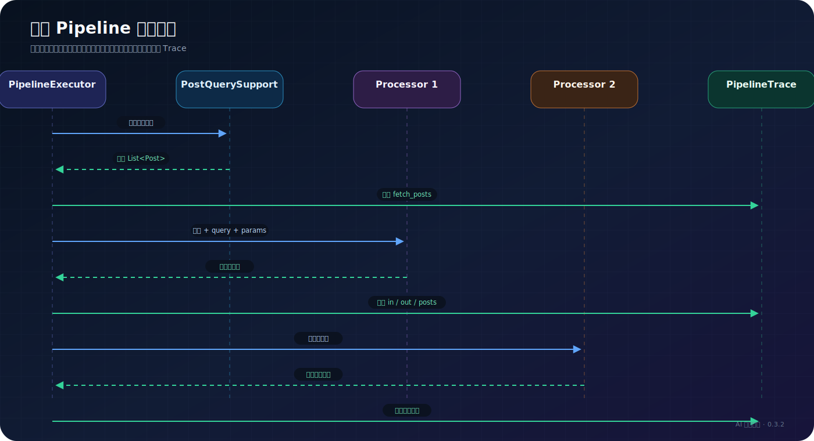
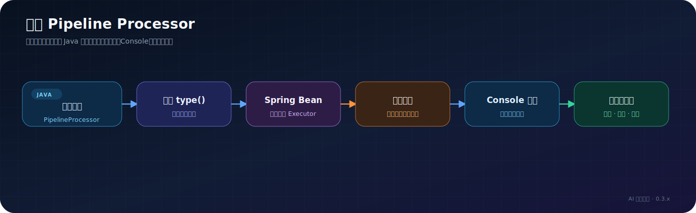
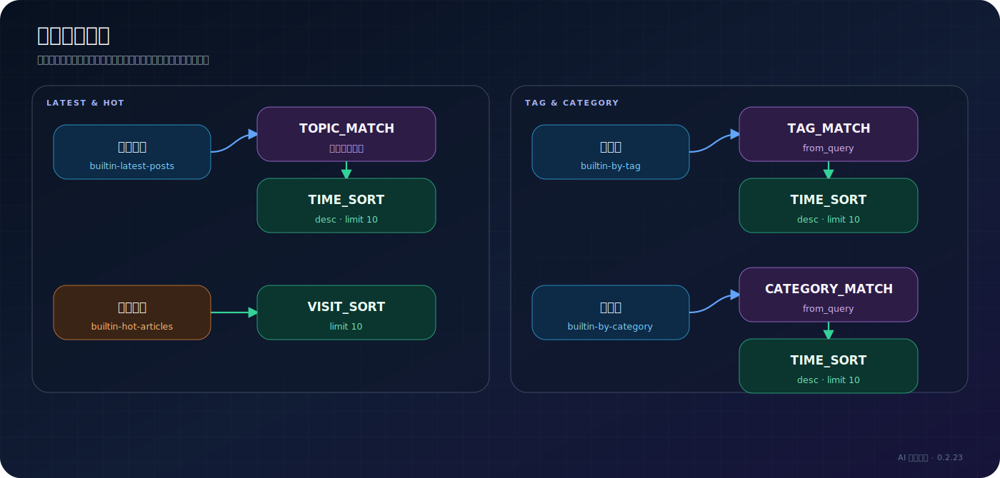

# 意图路由架构

> 适用读者：插件维护者、需要新增处理器的开发者

## 为什么有意图路由

RAG 擅长从文章片段中查找知识，但“最近发布了什么”“哪篇文章最热门”这类问题需要读取实时结构化数据并排序。意图路由把这些确定性请求从 RAG 分离出来，执行可配置 Pipeline，再直接返回确定性导语、文章引用和结构化卡片。除意图检测兜底或 Pipeline 本身包含 LLM 处理器外，命中意图后不会为了组织回答再次调用语言模型。

## 检测过程

[](/diagrams/exported/intent-detection.svg)

触发正则使用 `CASE_INSENSITIVE` 和 `find()`，即不区分大小写的部分匹配。配置保存时会校验正则，并限制高风险表达式；运行时若遇到非法正则，会降级为字面量包含。

## Pipeline 执行

[](/diagrams/exported/intent-pipeline.svg)

每一步接收上一步的 `List<Post>`，因此顺序有语义差异。例如“先主题过滤再按时间排序”和“先截取最新十篇再做主题过滤”不会得到同样的结果。

## 失败策略

当前实现的默认失败策略是 `empty`：处理器抛出异常时，该步返回空列表，防止把未经筛选的文章伪装成命中结果。

如果业务明确允许保留上一步候选，可在步骤参数中设置：

```text
onFailure=keep
```

未知处理器类型会被跳过并保留原候选，同时在 Trace 中记录降级。保存路由时通常会先被白名单校验拦截。

## 处理器注册

所有处理器实现 `PipelineProcessor` 并作为 Spring Component 注入。`PipelineExecutor` 按 `type()` 建立映射，因此增加处理器的基本过程是：

[](/diagrams/exported/processor-extension.svg)

只增加 Java 类还不够；还需要同步保存校验、Console 编辑器、参数说明和测试。

## 内置处理器

| 类型 | 数据作用 | 是否调用 LLM |
| --- | --- | --- |
| `TOPIC_MATCH` | 标签/分类强匹配与多字段语义判断取并集 | 是 |
| `LLM_TITLE_FILTER` | 根据标题判断主题相关性 | 是 |
| `TAG_MATCH` | 按文章标签过滤 | 否 |
| `CATEGORY_MATCH` | 按文章分类过滤 | 否 |
| `KEYWORD_MATCH` | 按标题或内容做字符串包含过滤 | 否 |
| `TIME_SORT` | 按发布时间排序并截取 | 否 |
| `VISIT_SORT` | 按 Halo Counter 浏览量排序并截取 | 否 |

`TOPIC_MATCH` 超时为 18 秒，`LLM_TITLE_FILTER` 超时为 8 秒。意图分类本身的 LLM 兜底超时为 2 秒，三者不是同一次模型调用。

## 内置路由

[](/diagrams/exported/builtin-intents.svg)

内置路由由 `IntentRouteService.ensureBuiltinIntents()` 懒注入。旧版内置路由会在满足迁移条件时升级，但管理员已经修改过的配置不会被随意覆盖。

## 输出阶段

Pipeline 返回文章后，`ChatService` 直接构造三部分结果：

1. 根据路由类型和文章数量生成简短、确定性的导语；
2. 将文章 permalink 转换为 `citations`；
3. 将标题、摘要、发布时间、访问量和链接等可信平台数据转换为 `structured_result`。

前台收到 `structured_result` 后渲染为彩色文章卡片。该阶段不再调用 Chat 模型，因此不会出现模型改写标题、遗漏候选文章或凭空补充文章的问题。SSE 事件顺序与字段见 [SSE 协议](../api/sse-protocol.md)。

`outputTemplate` 仍保留在 Extension、Console 表单和 API 中，用于兼容已有路由及 AI 创建草稿；0.3.2 当前的结构化卡片输出不读取它，也不会因为配置该字段而增加一次回答生成调用。真正会产生 `intent_pipeline` 用量的是 `TOPIC_MATCH`、`LLM_TITLE_FILTER` 等含模型的处理器。

## 数据模型

```text
IntentRoute.Spec
├── displayName / description
├── enabled / priority / builtin
├── triggerPatterns[]
├── llmFallback / llmFallbackHint
├── pipeline[]
│   └── type + params
├── outputTemplate（兼容字段，当前不参与结构化卡片生成）
└── updatedAt
```

## 相关实现

- `service/IntentDetector.java`
- `service/IntentRouteService.java`
- `intent/PipelineExecutor.java`
- `intent/PipelineProcessor.java`
- `intent/processor/`
- `extension/IntentRoute.java`

管理员配置说明见 [意图路由使用手册](../user-guide/intent-routing.md)。
