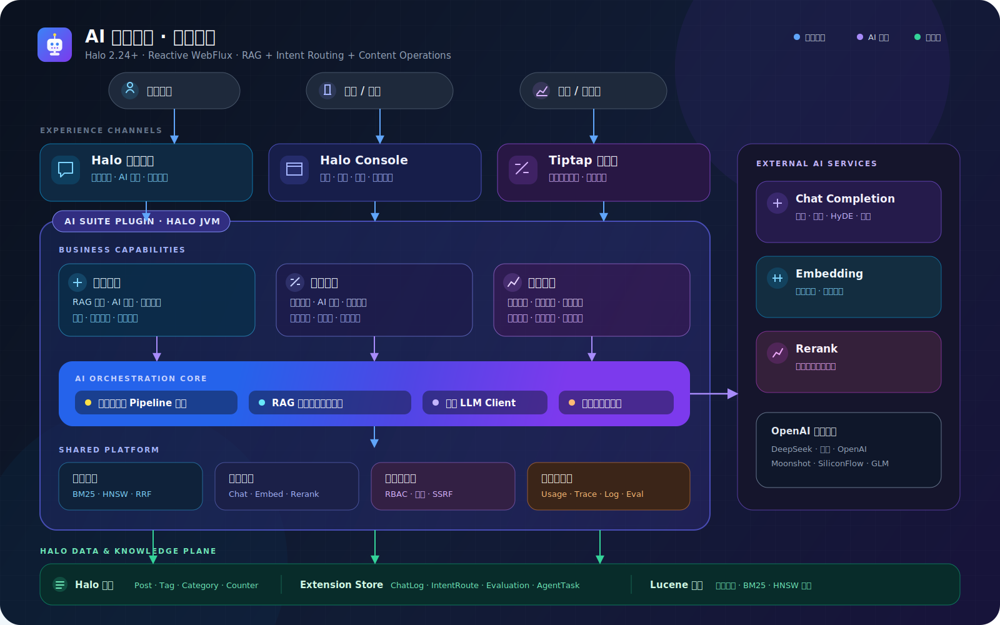
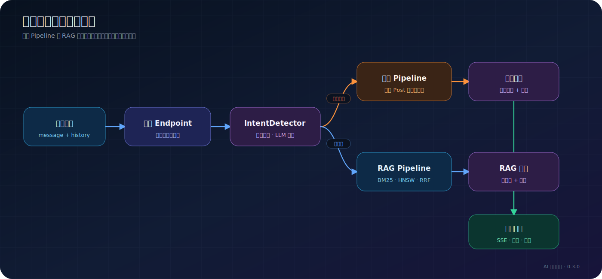
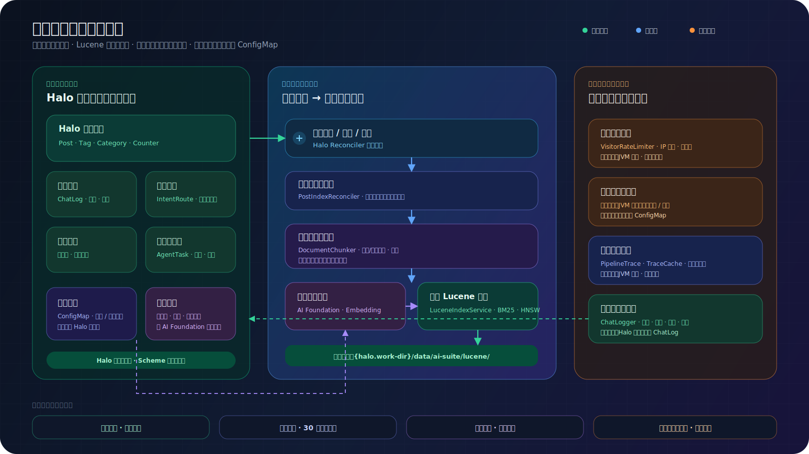
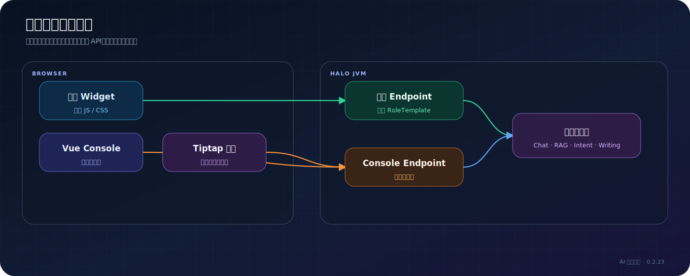

# 系统架构总览

> 适用读者：插件维护者、二次开发者、需要理解系统边界的运维人员

## 全景

系统由五层组成：体验入口、业务编排、共享 AI 能力、数据与索引、Halo 扩展机制。

| 层 | 主要职责 | 核心实现 |
| --- | --- | --- |
| 体验入口 | 访客 Widget、搜索页、编辑器与 Console | Widget JS/CSS、Vue、Tiptap |
| API 边界 | 公开和管理接口、认证、参数校验、SSE | Public/Console Endpoint |
| 业务编排 | 对话、意图、RAG、写作、脑图、评测 | Service、PipelineExecutor |
| 共享能力 | 模型调用、用量、限流、Trace | LlmClient、UsageTracker、LimitGuard |
| 数据与知识 | 配置、业务记录、文章、Lucene 索引 | ConfigMap、Secret、GVK、Lucene |

## 请求如何选择路径

意图路由与 RAG 最终复用相同的前台协议，因此 Widget 不需要知道后端选择了哪条路径。

## 数据、索引与运行状态

### 持久化业务数据

ConfigMap 保存普通配置，Secret 保存 API Key，自定义 Extension 保存 ChatLog、评测集、评测运行记录、意图路由和 Agent 任务记录。

### 可重建索引

Lucene 索引由公开文章生成。文章是事实来源，索引是可以全量重建的派生数据。

### 运行时状态

限流计数、TraceCache 和部分任务进度属于运行状态。不要把短期缓存当成业务数据备份。

## 前后端边界

公开 API 通过匿名 RoleTemplate 精确授权；Console API 由 Halo 管理员权限保护。前台资源通过插件扩展点和反向代理资源注入主题页面。

## 关键设计约束

- Java 21、Spring WebFlux、Halo Plugin API 2.24.0。
- Lucene 版本必须与 Halo 内置版本严格一致。
- `lucene-core` 等核心依赖使用 `compileOnly`，SmartCN 单独打包且不传递引入 Lucene Core。
- 模型接口采用 OpenAI 兼容协议。
- 访客流式请求使用 POST + `fetch` + `ReadableStream`。
- 配置由 ConfigMap 和 Secret 管理，不使用旧版 `settings.yaml`。
- 可选增强步骤失败时应尽量降级，核心边界失败则返回可理解的结果。

## 继续阅读

- [RAG 管线](rag-pipeline.md)
- [意图路由架构](intent-routing.md)
- [SSE 协议](../api/sse-protocol.md)
