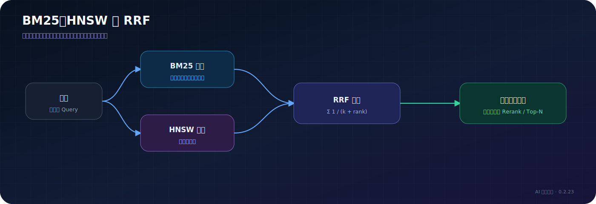
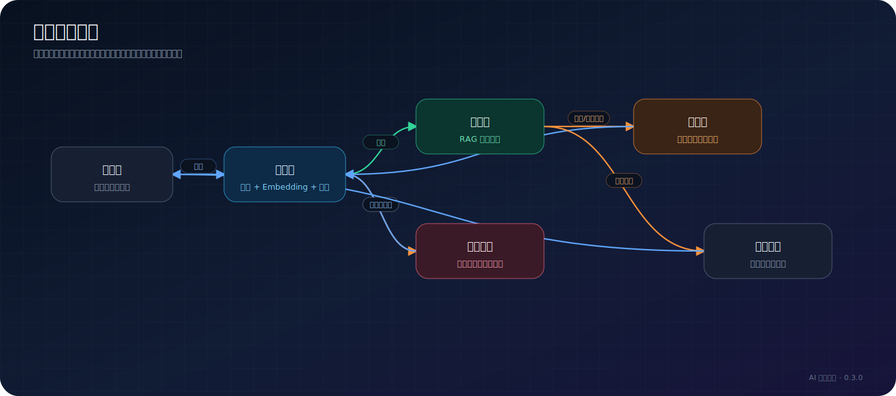

# RAG 管线

> 适用读者：插件维护者、RAG 调试人员、二次开发者

## 管线总览

RAG 的任务不是直接回答问题，而是从站内文章中找到可用于回答的上下文和引用。`ChatService` 再把这些内容与用户问题一起交给 Chat 模型。

## 完整处理过程

上方总览图已经完整展示 Query Rewrite、HyDE、三种检索模式、跨语言检索、Rerank 与降级路径。下面按阶段解释各节点的行为和边界。

## 三种检索模式

| 模式 | 需要 Embedding | 行为 |
| --- | --- | --- |
| `keyword` | 否 | 只使用 Lucene BM25，适合专有名词和精确关键词 |
| `vector` | 是 | 只依赖语义向量；缺少 Embedding 时返回空结果 |
| `hybrid` | 推荐配置 | BM25 与向量结果使用 RRF 融合；Embedding 缺失时降级为关键词检索 |

混合检索通常是默认选择，因为它同时保留关键词精确匹配和语义召回能力。

## Query Rewrite

Query Rewrite 使用模型把口语化、带上下文或指代不清的问题改写为更适合检索的查询。

- 默认关闭。
- 单步超时 2 秒。
- 可以携带对话历史。
- 开启“保留原查询”后，改写查询和原查询都会检索，再合并结果。
- 失败或结果不变时继续使用原问题。

## HyDE

HyDE 先让模型生成一段“假设性答案”，再对假设答案做 Embedding。它可能提升语义召回，但会增加一次 Chat 调用和延迟。

- 默认关闭。
- Chat 生成阶段超时 3 秒。
- 失败时回到直接对问题做 Embedding。

## BM25、HNSW 与 RRF

RRF 使用排名而不是直接混合两种不可比的原始分数，因此不需要先把 BM25 和向量分数归一化到相同尺度。

## 跨语言检索

跨语言检索用于用户问题语言和文章语言不同的场景。默认目标语言是 `en`，单步超时 3 秒。跨语言结果会先转换为 RRF 排名分，再与主检索结果合并去重。

如果站点内容基本只有一种语言，通常不需要开启。

## Rerank

Rerank 对初步召回的候选重新打分。适合文章数量多、相似主题密集的站点。

- 模型能力开关和管线开关都需要正确配置。
- 单步超时 2 秒。
- 可以配置分数阈值与最终数量。
- 失败时继续使用未重排候选。

## 超时与降级

| 阶段 | 单步超时 | 失败后的主要行为 |
| --- | ---: | --- |
| Query Rewrite | 2 秒 | 使用原问题 |
| HyDE | 3 秒 | 直接对问题向量化 |
| 跨语言 | 3 秒 | 只使用主检索 |
| Rerank | 2 秒 | 使用原候选顺序 |
| 整体检索 | 调用方约束 | 返回空 RAG 上下文并由上层处理 |

## Trace 如何阅读

常见阶段包括：

- `query_rewrite`：查询是否被改写。
- `embed`：向量维度和耗时。
- `hybrid_retrieve`：召回数量。
- `original_query`：原查询兜底。
- `cross_language`：跨语言结果。
- `merge_dedup`：合并去重前后数量。
- `rerank`：精排及过滤。
- `build_context`：最终上下文长度和文档数。

调试时不要只看最终回答。先确认正确文章是否进入候选，再判断是检索问题还是生成问题。

## 索引生命周期

文章发布和更新会触发索引同步。Embedding 模型或维度变化属于索引结构变化，应执行全量重建。

## 相关实现

- `rag/RAGPipeline.java`
- `rag/HybridRetriever.java`
- `rag/LuceneIndexService.java`
- `rag/DocumentChunker.java`
- `listener/PostIndexReconciler.java`

## 继续阅读

- [第一次 RAG 问答](../getting-started/first-rag-chat.md)
- [配置参考](../reference/configuration-reference.md)
- [故障排查](../operations/troubleshooting.md)
