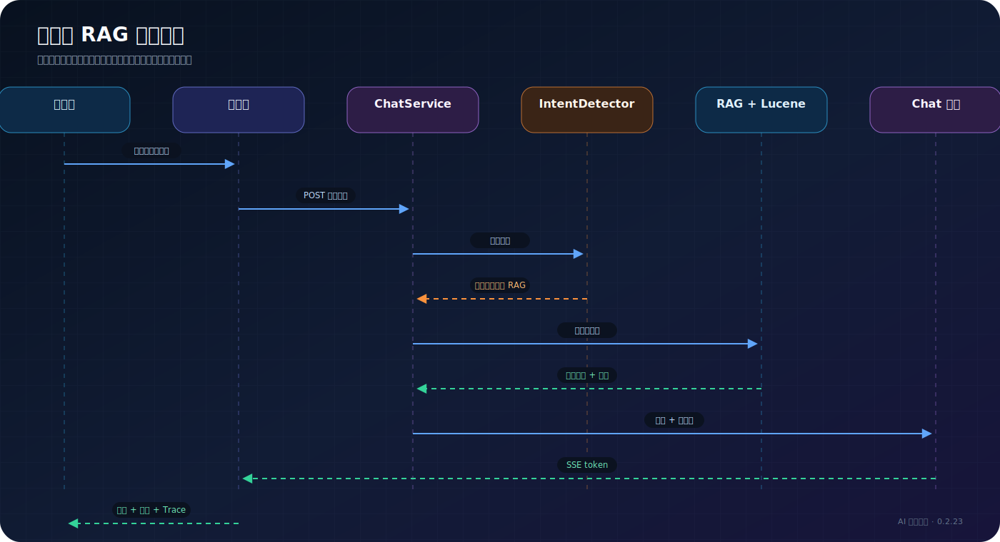

# 第一次 RAG 问答

> 适用读者：Halo 站长、RAG 调试人员  
> 前置条件：Chat 与 Embedding 模型测试通过，已经完成全量索引

## 目标

通过一个答案明确存在于站内文章的问题，确认“检索、引用、生成、日志”整条链路都正常。


## 选择测试问题

优先选择满足以下条件的问题：

- 答案只存在于你自己的文章中。
- 文章标题或正文包含明确关键词。
- 可以人工判断回答是否正确。
- 不依赖最新新闻或站外知识。

例如站内有一篇“如何为 Halo 配置 Nginx”的文章，可以问：

```text
站内文章建议怎样配置 Nginx 的 SSE？
```

第一次测试不要使用“你好”“你是谁”这类无法验证检索质量的问题。

## 执行路径



## 检查四个结果

### 1. 回答

回答应直接针对问题，并且关键事实能够在引用文章中找到。语言是否漂亮是第二优先级，事实是否来自站内内容才是第一优先级。

### 2. 引用

引用标题和链接应对应真实文章。没有引用时检查：

- “显示引用”是否开启。
- 检索结果是否为空。
- `topN` 是否过小。
- 相似度阈值是否过高。

### 3. Trace

Trace 应至少能看到查询、检索、上下文构建等阶段。启用增强能力后，还会出现 Query Rewrite、HyDE、跨语言或 Rerank 阶段。

### 4. 用量与日志

“用量统计”中应出现对应调用；访客正式问答还会产生 ChatLog。用量场景通常包含 `visitor_qa`、`search_embedding`，开启增强后还可能出现 `search_query_rewrite`、`search_hyde` 和 `search_rerank`。

## 如何判断问题在哪一层

| 现象 | 优先检查 |
| --- | --- |
| 完全没有检索结果 | 索引、关键词、Embedding、阈值 |
| 检索文章正确但回答错误 | System Prompt、上下文长度、Chat 模型 |
| 后台正常、访客端失败 | 访客开关、匿名权限、Nginx/SSE |
| 回答最后一次性出现 | 反向代理、CDN 或 WAF 缓冲 |
| 出现不相关引用 | 切片策略、`topK`、`topN`、Rerank |
| 换模型后结果异常 | 向量维度与索引重建 |

## 调参顺序

建议一次只改一组参数：

1. 先确认文章确实进入索引。
2. 使用默认混合检索跑通。
3. 调整 `topK`、`topN` 和相似度阈值。
4. 再开启 Query Rewrite 或 Rerank。
5. 只有跨语言需求明确时才开启跨语言检索。

同时改变所有参数会让问题难以定位。

## 相关文档

- [RAG 管线](../architecture/rag-pipeline.md)
- [配置参考](../reference/configuration-reference.md)
- [故障排查](../operations/troubleshooting.md)
