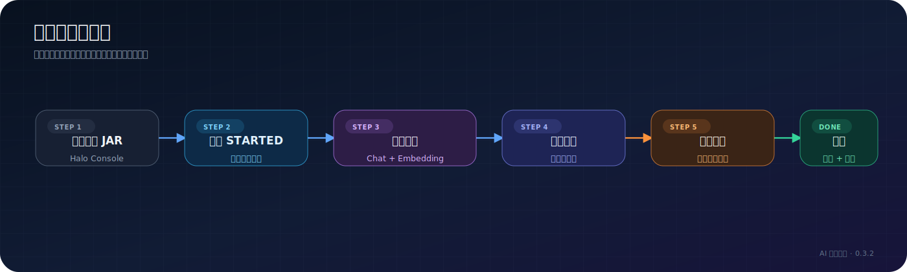
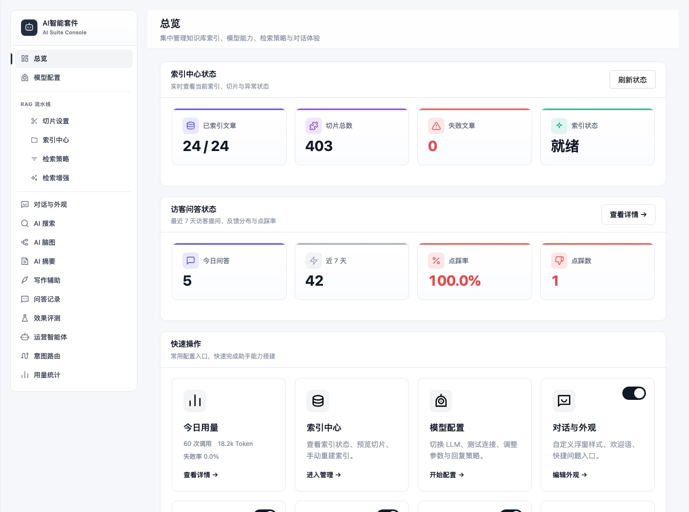
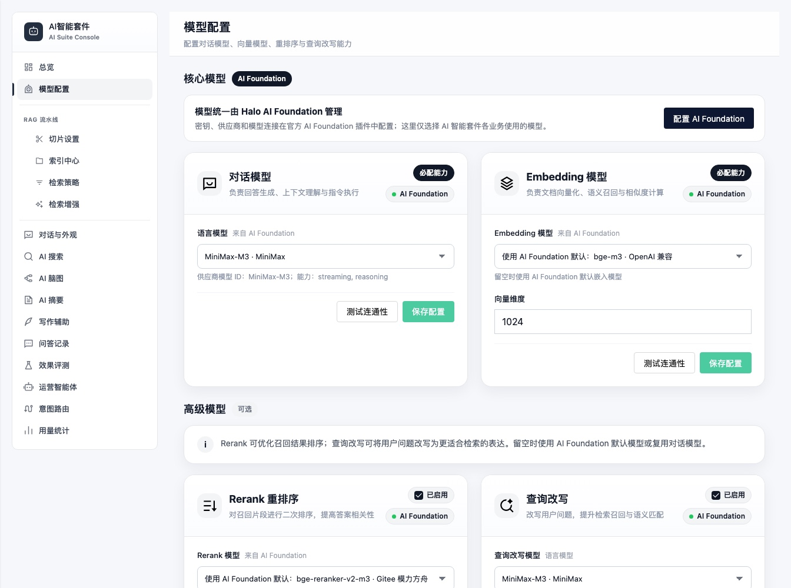
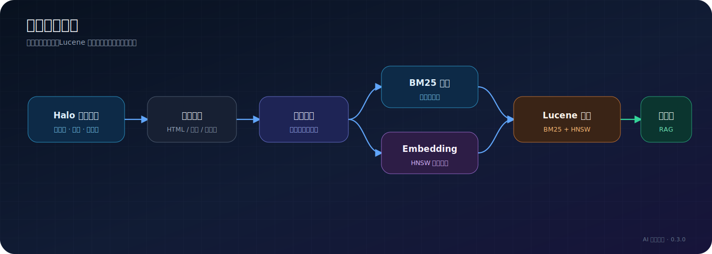
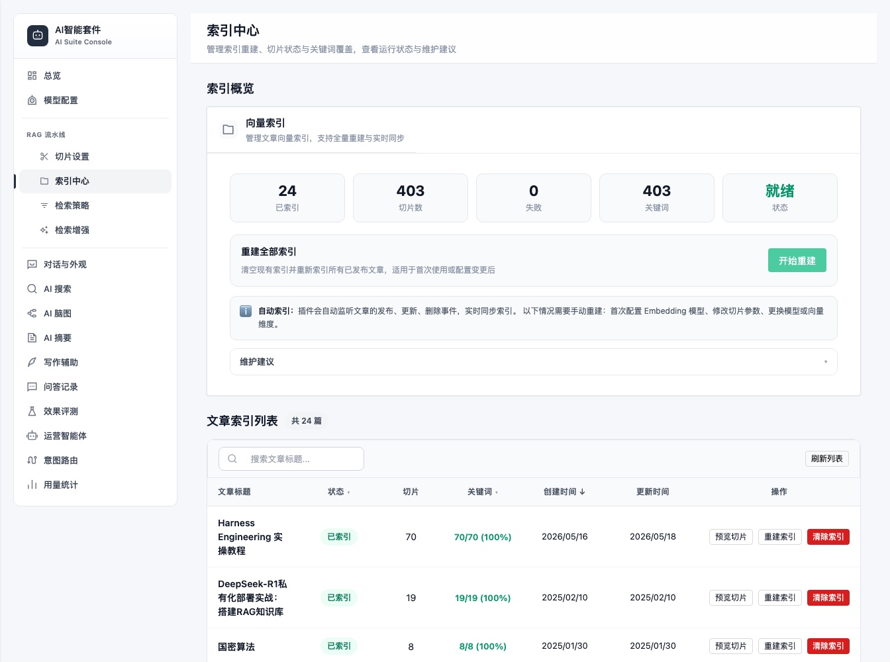

# 安装与首次配置

> 适用读者：Halo 站长、首次部署人员  
> 适用版本：AI 智能套件 0.3.x、Halo 2.25+
> 预计耗时：15～30 分钟

## 安装完成后的目标状态

[](/diagrams/exported/installation-journey.svg)

## 环境要求

| 项目 | 要求 |
| --- | --- |
| Halo | 2.25.0 或更高版本 |
| 必需插件 | Halo AI Foundation（插件 ID：`ai-foundation`） |
| 访客搜索入口 | 启用 AI 搜索时，默认还需安装并启用 Halo 官方搜索插件；仅在主题或自定义代码已提供兼容搜索入口时可不安装 |
| 插件安装方式 | Halo Console 上传 JAR |
| 语言模型 | 在 Halo AI Foundation 中配置可用 |
| Embedding 模型 | 在 Halo AI Foundation 中配置可用 |
| 浏览器 | 支持 `fetch` 和 `ReadableStream` 的现代浏览器 |
| 反向代理 | 使用 SSE 时必须避免代理缓冲 |

Rerank 和 Query Rewrite 模型是可选能力。第一次安装时先在 Halo AI Foundation 中把语言模型与 Embedding 模型跑通，再回到 AI 智能套件开启增强能力。

Halo 官方搜索插件不是 AI 搜索后端接口的运行依赖，但它是默认访客搜索框的入口来源。若未启用官方搜索插件，且当前主题也没有自行提供兼容搜索按钮，普通访客在页面上看不到搜索框；此时即使接口和快捷键可用，也不应视为访客搜索已经完整启用。

## 1. 安装插件

先安装并启用 Halo AI Foundation，再安装 AI 智能套件。`plugin.yaml` 已声明 `ai-foundation` 为必需依赖，如果缺少 AI Foundation，AI 智能套件不能正常启动模型相关能力。

从项目 [GitLab Releases](https://gitlab.rainwu.cn/rainwu/halo-plugin-ai-suite/-/releases) 下载 `plugin-ai-suite-*.jar`，在 Halo Console 中进入“插件”，上传并启用。

如果从源码构建：

```bash
JAVA_HOME=~/jdk21/contents/Contents/Home ./gradlew build
```

构建产物位于：

```text
build/libs/plugin-ai-suite-0.3.2.jar
```

本项目开发环境不使用 Docker，也不要运行 `./gradlew haloServer`。

### 验证插件状态

Console 中插件应显示为已启用。开发环境也可以调用 Halo 插件资源 API：

```bash
curl -u YOUR_ADMIN_USERNAME \
  http://127.0.0.1:8090/apis/plugin.halo.run/v1alpha1/plugins/ai-suite
```

`YOUR_ADMIN_USERNAME` 只是管理员用户名占位符，请替换为当前 Halo 环境中的实际管理员账号。命令执行后由 curl 提示输入密码，可以避免把明文密码写进命令和 Shell 历史。示例地址 `127.0.0.1:8090` 同样需要按实际 Halo 地址调整；生产环境通常应使用自己的 HTTPS 域名。

响应中的 `status.phase` 应为 `STARTED`。

## 2. 配置 AI Foundation 模型

进入“AI 智能套件”后，可先通过总览确认索引、访客问答和功能入口的整体状态：



先进入 Halo AI Foundation 插件，配置语言模型、Embedding 模型和需要的 Rerank 模型。供应商、Base URL、API Key 都在 AI Foundation 中维护。

再进入“AI 智能套件 → 模型配置”，按需填写 AI Foundation 模型资源名：



- 语言模型资源名，留空使用 AI Foundation 默认语言模型。
- Embedding 模型资源名，留空使用 AI Foundation 默认嵌入模型。
- Rerank 模型资源名，留空使用 AI Foundation 默认 Rerank 模型。
- 查询改写模型资源名，留空复用语言模型。

点击连通性测试。成功只代表模型接口可调用，不代表 RAG 已经可用。

## 3. 配置 Embedding 模型

在 AI Foundation 中确认 Embedding 模型可用，并在 AI 智能套件中填写向量维度。默认维度为 1024，但最终值必须与实际服务返回一致。

> Embedding 模型名称或向量维度变化后，必须执行全量重建。旧向量不能与新模型生成的向量混用。

## 4. 建立文章索引

进入“索引中心”，点击“全量重建”。插件会处理已发布的公开文章：

[](/diagrams/exported/index-build-flow.svg)



### 验证索引

- 索引文章数不应为 0，除非站点没有已发布公开文章。
- 随机打开一篇文章，应能看到切片内容。
- 构建失败时先检查 Embedding 连通性和向量维度。

## 5. 完成第一次问答

进入“对话与外观”的调试区域，提一个答案明确存在于站内文章中的问题。成功状态包括：

- 流式出现回答文字。
- 回答内容与文章一致。
- 开启引用后能看到来源文章。
- 调试 Trace 中能看到检索阶段和命中文档。

完整验证步骤见 [第一次 RAG 问答](first-rag-chat.md)。

## 6. 再开启访客功能

后台调试成功后，再按需开启访客聊天、AI 搜索、脑图、摘要和写作辅助。启用 AI 搜索时，还要确认 Halo 官方搜索插件已启用并能显示访客搜索框，或主题已经提供可点击的兼容入口。生产环境应先完成 [生产部署](../operations/production-deployment.md) 中的 SSE 代理配置。

## 配置保存在哪里

[](/diagrams/exported/config-storage.svg)

AI 智能套件普通配置保存在 ConfigMap `ai-suite-configmap`。模型供应商、Base URL、API Key 和默认模型由 Halo AI Foundation 自己保存和管理。

## 下一步

- [第一次 RAG 问答](first-rag-chat.md)
- [配置参考](../reference/configuration-reference.md)
- [生产部署](../operations/production-deployment.md)
- [故障排查](../operations/troubleshooting.md)
- [当前版本能力清单](../reference/current-version.md)
