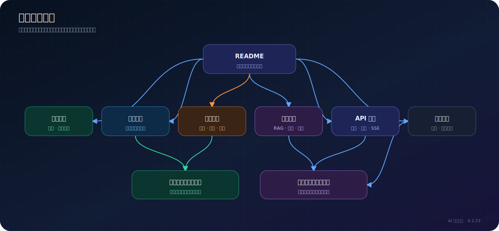

# AI 智能套件文档中心

> 适用版本：AI 智能套件 0.3.2、Halo 2.25+

这里是 AI 智能套件的完整文档入口。根目录的 `README.md` 用于介绍产品和帮助第一次安装；本目录负责操作手册、生产运维、系统架构、API 和二次开发。

## 按你的目标开始

| 我想要…… | 从这里开始 |
| --- | --- |
| 第一次安装插件 | [安装与首次配置](getting-started/installation.md) |
| 完成第一次 RAG 问答 | [第一次 RAG 问答](getting-started/first-rag-chat.md) |
| 部署到生产环境 | [生产部署](operations/production-deployment.md) |
| 配置自定义问答意图 | [意图路由使用手册](user-guide/intent-routing.md) |
| 理解 RAG 怎样工作 | [RAG 管线](architecture/rag-pipeline.md) |
| 理解整个系统 | [系统架构](architecture/overview.md) |
| 核对当前版本能力 | [当前版本能力清单](reference/current-version.md) |
| 配置深度思考 | [深度思考与推理过程](user-guide/reasoning-mode.md) |
| 查询所有配置默认值 | [配置参考](reference/configuration-reference.md) |
| 对接流式接口 | [SSE 协议](api/sse-protocol.md) |
| 定位运行故障 | [故障排查](operations/troubleshooting.md) |

## 文档地图

## 已完成文档

### 快速开始

- [安装与首次配置](getting-started/installation.md)
- [第一次 RAG 问答](getting-started/first-rag-chat.md)

### 用户手册

- [模型、切片与检索配置](user-guide/models-and-retrieval.md)
- [访客问答与浮窗](user-guide/rag-chat.md)
- [深度思考与推理过程](user-guide/reasoning-mode.md)
- [AI 搜索](user-guide/ai-search.md)
- [索引中心](user-guide/knowledge-index.md)
- [AI 脑图](user-guide/mindmap.md)
- [AI 摘要](user-guide/excerpt.md)
- [编辑器 AI 写作辅助](user-guide/writing-assistant.md)
- [意图路由使用手册](user-guide/intent-routing.md)
- [RAG 效果评测](user-guide/evaluation.md)
- [运营智能体](user-guide/content-agent.md)
- [用量统计与限流](user-guide/usage-and-limits.md)
- [问答记录与反馈](user-guide/chat-logs.md)

### 生产运维

- [生产部署](operations/production-deployment.md)
- [故障排查](operations/troubleshooting.md)
- [升级与迁移](operations/upgrade-and-migration.md)
- [备份与恢复](operations/backup-and-restore.md)
- [监控与安全](operations/monitoring-and-security.md)

### 系统架构

- [系统架构总览](architecture/overview.md)
- [项目模块地图](architecture/project-map.md)
- [RAG 管线](architecture/rag-pipeline.md)
- [意图路由架构](architecture/intent-routing.md)
- [数据存储与生命周期](architecture/data-storage.md)

### API 与参考资料

- [API 总览](api/overview.md)
- [Public API](api/public-api.md)
- [Console API](api/console-api.md)
- [SSE 协议](api/sse-protocol.md)
- [配置参考](reference/configuration-reference.md)
- [当前版本能力清单](reference/current-version.md)
- [用量场景参考](reference/usage-scenarios.md)
- [兼容矩阵](reference/compatibility-matrix.md)
- [自定义 Extension 参考](reference/extension-resources.md)

### 开发指南

- [本地开发](development/local-development.md)
- [测试指南](development/testing.md)
- [Widget 开发](development/widget-development.md)
- [新增意图处理器](development/adding-intent-processor.md)
- [发布流程](development/release-process.md)

## 文档事实来源

当描述与代码不一致时，按以下优先级核对：

1. Endpoint、Service、`AIProperties` 等当前源码。
2. `plugin.yaml`、RoleTemplate 和 Gradle 配置。
3. 本目录中的版本化文档。
4. 根目录 `README.md`。

## 文档贡献规范

新增或修改文档前，请阅读 [文档写作规范](contributing-docs.md)。核心要求是：操作步骤必须可验证、配置必须写明默认值和生效条件、复杂流程必须配图、版本变化必须同步更新相关页面。
