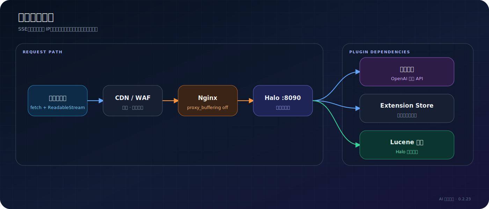
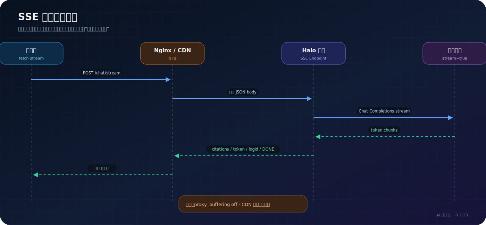

# 生产部署

> 适用读者：Halo 运维人员、站长  
> 适用版本：AI 智能套件 0.2.23、Halo 2.24+

## 推荐部署拓扑



生产部署需要同时保证普通 HTTP、SSE 长连接、真实客户端 IP 和模型服务访问正常。

## 部署前检查

- Halo 版本满足 `>=2.24.0`。
- 插件版本与目标 Halo 版本兼容。
- Chat、Embedding 服务可以从 Halo 所在服务器访问。
- Halo 数据目录有足够空间保存 Lucene 索引。
- 备份现有 Halo 数据和插件配置。
- 反向代理允许较长的响应时间，且不会缓冲 SSE。

## Nginx 配置

```nginx
location / {
    proxy_pass http://127.0.0.1:8090;

    proxy_set_header Host $host;
    proxy_set_header X-Real-IP $remote_addr;
    proxy_set_header X-Forwarded-For $proxy_add_x_forwarded_for;
    proxy_set_header X-Forwarded-Proto $scheme;

    proxy_http_version 1.1;
    proxy_set_header Connection "";
    proxy_buffering off;
    proxy_cache off;
    proxy_read_timeout 300s;
}
```

### 每一项解决什么问题

| 配置 | 作用 |
| --- | --- |
| `proxy_buffering off` | 避免 Nginx 等到缓冲区积满后一次性返回 token |
| `proxy_http_version 1.1` | 为持续响应使用稳定的 HTTP/1.1 代理行为 |
| `Connection ""` | 不向上游发送错误的 hop-by-hop 连接头 |
| `proxy_cache off` | 防止动态流式响应进入代理缓存 |
| `proxy_read_timeout 300s` | 允许长回答保持连接 |
| `X-Forwarded-For` | 让访客限流与日志识别真实客户端 IP |

`X-Accel-Buffering: no` 只能作为应用返回给代理的提示，不能可靠替代 Nginx 显式配置。CDN 或 WAF 也可能独立缓冲响应，需要在对应平台关闭响应聚合、内容优化或缓存。

## SSE 流量路径



## 验证配置

检查并重载 Nginx：

```bash
nginx -T
nginx -t
nginx -s reload
```

使用 `curl -N` 验证 SSE。`-N` 会关闭 curl 自己的输出缓冲：

```bash
curl -N -X POST \
  'https://YOUR_DOMAIN/apis/api.ai-suite.halo.run/v1alpha1/chat/stream' \
  -H 'Content-Type: application/json' \
  --data '{"message":"请介绍站内内容","history":[]}'
```

正常情况下会逐步出现事件，而不是长时间无输出后一次性返回：

```text
event:citations
data:[...]

data:{"content":"..."}

event:logId
data:...

data:[DONE]
```

## 验证公开权限

访客接口由匿名 RoleTemplate 放行。无需登录访问以下接口时不应返回 401/403：

- `POST /apis/api.ai-suite.halo.run/v1alpha1/chat/stream`
- `POST /apis/api.ai-suite.halo.run/v1alpha1/chat`
- `POST /apis/api.ai-suite.halo.run/v1alpha1/search/answer`
- `GET /apis/api.ai-suite.halo.run/v1alpha1/search/halo-results`
- `GET /apis/api.ai-suite.halo.run/v1alpha1/widget-config`

Console API 不应匿名开放。

## 生产安全

- 模型 API Key 只通过 Console 保存到 Secret，不写入代码或 Nginx 配置。
- 开启访客限流，并确认代理正确传递客户端 IP。
- 根据预算设置模型每日 token 上限。
- 不把本地开发账号 `admin/admin123` 用于生产。
- 限制 Halo 数据目录和备份文件的访问权限。
- 对 CDN/WAF 日志进行脱敏，避免记录完整问题和 Authorization。

## 发布后验收

1. 插件状态为 `STARTED`。
2. 模型连接测试成功。
3. 索引文章数与预期接近。
4. 后台调试问答能返回正确引用。
5. 匿名访客能使用已开启功能。
6. SSE token 是逐步到达的。
7. 用量统计和问答日志有新增记录。
8. 限流规则能识别真实访客 IP。

## 相关文档

- [SSE 协议](../api/sse-protocol.md)
- [故障排查](troubleshooting.md)
- [配置参考](../reference/configuration-reference.md)
