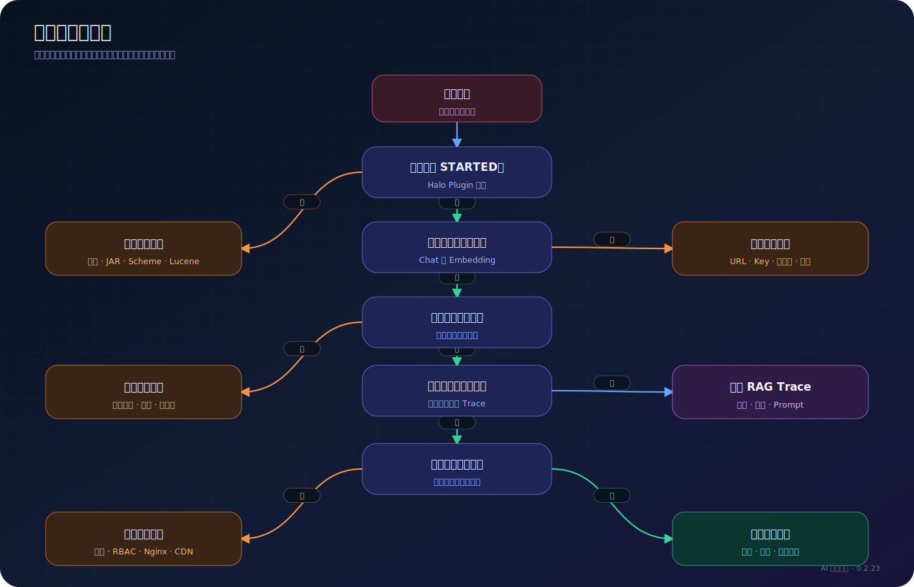

# 故障排查

> 适用读者：Halo 站长、运维人员、插件开发者

## 总体排查路径



## 插件无法启动

### 检查插件状态

```bash
curl -u USER:PASSWORD \
  http://127.0.0.1:8090/apis/plugin.halo.run/v1alpha1/plugins/ai-suite
```

### 查看日志

本地开发环境：

```bash
tail -n 200 /tmp/halo-dev.log
```

重点搜索：

```bash
rg -n "ai-suite|ERROR|Exception|Lucene|Scheme" /tmp/halo-dev.log
```

常见原因包括 Halo 版本不满足要求、JAR 不完整、Lucene 版本不一致和插件 reload 后残留旧 Scheme。

## 回答不是流式，而是最后一次性显示

这通常不是 LLM 没有流式输出，而是 Nginx、CDN 或 WAF 缓冲。

1. 使用 `curl -N` 直连 Halo 8090。
2. 再使用相同命令访问公网域名。
3. 如果直连流式、公网非流式，问题位于代理链。
4. 检查 `proxy_buffering off`、CDN 缓存和内容优化。

详见 [生产部署](production-deployment.md)。

## 公开接口返回 401 或 403

检查：

- 插件是否已重新启用，使 RoleTemplate 被加载。
- `role-template-public.yaml` 是否包含目标资源或 non-resource URL。
- 请求方法是否正确。聊天和搜索 AI 回答使用 POST。
- 是否访问了正确的 `api.ai-suite.halo.run/v1alpha1` 前缀。

Console API 本来就需要管理员认证，不应匿名访问。

## 索引文章数为 0

- 确认站点存在已发布、公开且未删除的文章。
- 测试 Embedding 模型。
- 检查向量维度。
- 查看全量重建进度和 Halo 日志。
- 确认 Halo 数据目录可写。

## 更换 Embedding 后结果异常

更换模型、服务商或向量维度后执行全量重建。仅保存新配置不会转换旧索引中的向量。

## 有检索结果但回答不正确

按层判断：

| Trace 情况 | 处理方向 |
| --- | --- |
| 命中文章错误 | 调整切片、检索模式、阈值、Rerank |
| 命中文章正确但切片不完整 | 增大切片或优化标题/句子边界 |
| 上下文正确但回答错误 | 调整 System Prompt 或 Chat 模型 |
| Query Rewrite 偏离原问题 | 关闭改写或开启保留原查询 |
| Rerank 过滤掉正确文章 | 降低分数阈值或增大 Rerank Top-N |

## 意图路由没有命中

- 路由必须处于启用状态。
- 触发正则使用部分匹配，但仍应检查大小写、转义和边界。
- 多个路由都能命中时，优先级高的先返回。
- 配置修改后最多可能受 30 秒启用路由缓存影响。
- LLM 兜底只有在 `llmFallback=true` 且 Chat API Key 可用时执行。

## 意图命中但没有文章

- 在 Console 使用“试跑”查看每一步输入输出。
- 检查 `TAG_MATCH`/`CATEGORY_MATCH` 的实际名称。
- 检查 TOPIC_MATCH 的别名。
- 处理器失败默认返回空列表；只有设置 `onFailure=keep` 才保留上一步候选。
- 排序处理器不会创造候选，前一步已经过滤为空时仍然为空。

## 用量突然被拒绝

- 查看模型每日 token 上限。
- 查看访客小时/每日限制。
- 确认 `X-Forwarded-For` 没有让所有访客显示为同一个代理 IP。
- 检查白名单格式。
- 区分模型预算限制与访客频率限制。

## 本地开发环境

```bash
./dev-start.sh --stop
./dev-start.sh
```

仅更新插件：

```bash
./dev-start.sh --deploy-only
```

必须使用 JDK 21，并从项目提供的脚本启动。Halo 的运行工作目录必须是 `dev/`。
