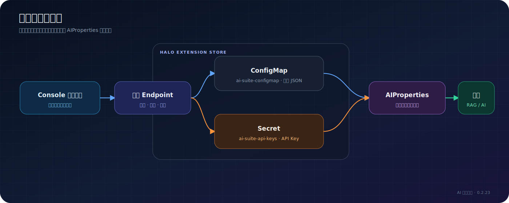

# 配置参考

> 事实来源：`AIProperties.java` 当前默认值  
> 适用版本：AI 智能套件 0.2.23

## 配置存储

ConfigMap 的每个 `data.<group>` 是一段 JSON 字符串。以下密钥单独存入 Secret：`chatApiKey`、`embeddingApiKey`、`rerankApiKey`、`queryRewriteApiKey`、`writingApiKey`。

## 模型配置 `models`

| 字段 | 默认值 | 说明 |
| --- | --- | --- |
| `chatBaseUrl` | `https://api.deepseek.com/v1` | Chat API 地址 |
| `chatApiKey` | 空 | Chat API Key，存入 Secret |
| `chatModel` | `deepseek-chat` | Chat 模型名称 |
| `embeddingBaseUrl` | `https://dashscope.aliyuncs.com/compatible-mode/v1` | Embedding API 地址 |
| `embeddingApiKey` | 空 | Embedding API Key |
| `embeddingModel` | `text-embedding-v3` | Embedding 模型名称 |
| `embeddingDimensions` | `1024` | 索引向量维度；变更后需全量重建 |
| `rerankEnabled` | `false` | 是否配置 Rerank 能力 |
| `rerankBaseUrl` | `https://api.siliconflow.cn/v1` | Rerank API 地址 |
| `rerankApiKey` | 空 | Rerank API Key |
| `rerankModel` | `BAAI/bge-reranker-v2-m3` | Rerank 模型 |
| `queryRewriteEnabled` | `false` | 是否配置 Query Rewrite 模型能力 |
| `queryRewriteBaseUrl` | `https://open.bigmodel.cn/api/paas/v4/` | 改写模型地址 |
| `queryRewriteApiKey` | 空 | 改写模型 API Key |
| `queryRewriteModel` | `glm-4-flash` | 改写模型名称 |

模型能力开关表示服务是否可用；检索增强页中的管线开关决定一次 RAG 请求是否实际调用它。

## 切片配置 `chunking`

| 字段 | 默认值 | 说明 |
| --- | ---: | --- |
| `chunkMode` | `auto` | 切片模式 |
| `chunkSize` | `500` | 目标切片大小 |
| `chunkOverlap` | `50` | 相邻切片重叠 |
| `chunkSeparator` | 两个换行 | 自定义分隔符 |
| `markdownHeadingAware` | `true` | 感知 Markdown 标题边界 |
| `sentenceAware` | `true` | 尽量在句子边界切分 |
| `cleanWhitespace` | `true` | 清理多余空白 |
| `minChunkSize` | `50` | 过短切片的下限 |
| `autoKeywords` | `false` | 是否自动提取关键词 |
| `autoKeywordsCount` | `3` | 每篇/切片关键词数量 |
| `keywordsMaxTokens` | `1024` | 关键词生成输出上限 |
| `keywordsBatchSize` | `20` | 关键词处理批量大小 |

修改切片策略不会自动改写已有切片。需要对受影响文章执行单篇重建或全量重建。

## 检索配置 `retrieval`

| 字段 | 默认值 | 说明 |
| --- | ---: | --- |
| `searchMode` | `hybrid` | `keyword`、`vector` 或 `hybrid` |
| `semanticWeight` | `0.7` | 混合检索中的语义权重配置 |
| `topK` | `20` | 初步召回数量 |
| `similarityThreshold` | `0.5` | 相似度过滤阈值 |
| `topN` | `5` | 构建上下文的最终文档数 |
| `showReferences` | `false` | 是否展示引用 |
| `noMatchBehavior` | `continue` | 无命中时继续回答或使用固定回复 |
| `noMatchReply` | `抱歉，未在博客中找到与您问题相关的内容。` | 无命中回复 |

## 检索增强 `enhancement`

| 字段 | 默认值 | 说明 |
| --- | ---: | --- |
| `queryRewriteToggle` | `false` | 在 RAG 中启用 Query Rewrite |
| `queryRewritePrompt` | 空 | 自定义改写提示词 |
| `queryRewriteWithHistory` | `true` | 改写时携带对话历史 |
| `keepOriginalQuery` | `false` | 同时检索原问题并合并 |
| `hydeEnabled` | `false` | 启用 HyDE |
| `hydePrompt` | 空 | 自定义 HyDE 提示词 |
| `rerankToggle` | `false` | 在 RAG 中启用 Rerank |
| `rerankScoreThreshold` | `0.0` | Rerank 结果过滤阈值 |
| `rerankTopN` | `5` | Rerank 后保留数量 |
| `crossLanguageEnabled` | `false` | 启用跨语言检索 |
| `crossLanguageTargets` | `en` | 目标语言 |
| `crossLanguageMaxResults` | `5` | 跨语言结果数量 |

## 对话与 Widget `chat`

| 字段 | 默认值 | 说明 |
| --- | ---: | --- |
| `systemPrompt` | 空 | 对话全局提示词 |
| `temperature` | `0.7` | 回答随机性 |
| `maxTokens` | `2048` | 最大输出 token |
| `historyTurns` | `5` | 携带历史轮数 |
| `streamOutput` | `true` | 流式输出开关 |
| `allowGuest` | `true` | 是否允许访客调用聊天 |
| `welcomeMessage` | `Hi! 有什么想了解的？` | 欢迎语 |
| `shortcutQuestions` | 空 | 快捷问题，每行一个 |
| `widgetPosition` | `right-bottom` | Widget 位置 |
| `widgetThemeColor` | `#5387C4` | 主题色 |
| `widgetIcon` | `ri-chat-3-line` | 图标 |
| `widgetTriggerSize` | `35` | 触发器尺寸 |
| `widgetTriggerLabel` | `AI` | 触发器文字 |
| `widgetTheme` | `auto` | `auto`、`light`、`dark` |
| `widgetWidth` | `400` | 桌面端宽度 |
| `widgetHeight` | `600` | 桌面端高度 |
| `widgetTriggerAlign` | `auto` | 自动避让或手动对齐 |
| `widgetTriggerOffsetY` | `125` | 手动模式底部偏移 |
| `widgetTriggerOffsetX` | `17` | 水平边缘偏移 |
| `widgetTriggerShape` | `square` | `square`、`rounded`、`circle` |
| `showPrivacyTip` | `false` | 显示隐私提示 |
| `showRetrievalStatus` | `false` | 显示检索状态 |

## AI 摘要 `excerpt`

| 字段 | 默认值 | 说明 |
| --- | ---: | --- |
| `enabled` | `false` | 启用摘要扩展点 |
| `maxLength` | `160` | 目标摘要字符数 |
| `maxInputLength` | `3000` | 送入模型的原文字符上限 |
| `temperature` | `0.3` | 生成温度 |
| `maxTokens` | `512` | 输出 token 上限 |
| `prompt` | 空 | 自定义提示词 |

## 写作辅助 `writing`

| 字段 | 默认值 | 说明 |
| --- | ---: | --- |
| `enabled` | `true` | 编辑器 AI 功能总开关 |
| `writingBaseUrl` | 空 | 为空时复用 Chat 模型地址 |
| `writingApiKey` | 空 | 独立写作 API Key |
| `writingModel` | 空 | 为空时复用 Chat 模型 |
| `outlineTemperature` | `0.3` | 大纲温度 |
| `outlineSections` | `6` | 顶层章节数量 |
| `outlineDepth` | `1` | 大纲深度，合法范围 1～3 |
| `outlineNumbering` | `chinese` | `chinese`、`chinese-paren`、`arabic`、`roman`、`none` |
| `outlineExtraPrompt` | 空 | 大纲附加约束 |
| `maxInputLength` | `6000` | 单次输入字符上限 |
| `maxTokens` | `2048` | 输出 token 上限 |

## AI 搜索 `search`

| 字段 | 默认值 | 说明 |
| --- | ---: | --- |
| `enabled` | `true` | 搜索功能总开关 |
| `showAiAnswer` | `true` | 显示 AI 综合回答 |
| `resultCount` | `10` | 关键词结果数，运行时限制为 1～30 |
| `systemPrompt` | 空 | 为空时复用对话提示词 |
| `maxTokens` | `512` | 搜索回答 token 上限 |
| `theme` | `inherit` | 搜索界面主题 |
| `themeColor` | 空 | 为空时继承问答主题色 |

## AI 脑图 `mindmap`

| 字段 | 默认值 | 说明 |
| --- | ---: | --- |
| `enabled` | `true` | 脑图总开关 |
| `temperature` | `0.3` | 生成温度 |
| `maxTokens` | `2048` | 输出 token 上限 |
| `maxInputLength` | `15000` | 原文字符上限 |
| `maxDepth` | `3` | 层级深度，运行时限制 2～4 |
| `extraPrompt` | 空 | 追加生成要求 |
| `theme` | `inherit` | 脑图主题 |
| `themeColor` | 空 | 为空时继承问答主题色 |

## 用量与访客限流 `usageLimits`

| 字段 | 默认值 | 说明 |
| --- | --- | --- |
| `enabled` | `false` | 启用模型每日限额 |
| `chatModelLimits` | 空 Map | 按模型名称配置每日 token 上限 |
| `visitor.enabled` | `false` | 启用访客限流 |
| `visitor.dailyLimit` | `0` | 每 IP 每日限制；0 表示未设置 |
| `visitor.hourlyLimit` | `0` | 每 IP 每小时限制 |
| `visitor.whitelist` | 空数组 | IP 白名单 |

旧字段 `perModel` 仍可兼容读取并迁移到 `chatModelLimits` 语义。

## 变更影响速查

| 变更 | 是否需要重建索引 |
| --- | --- |
| Chat 模型、Prompt、温度 | 否 |
| Embedding 模型或维度 | 是，全量重建 |
| 切片大小、重叠、分隔规则 | 是，重建受影响文章 |
| 检索 Top-K、Top-N、阈值 | 否 |
| Query Rewrite、HyDE、Rerank | 否 |
| Widget 主题和位置 | 否，刷新前台 |
| 脑图生成参数 | 不影响 RAG；旧脑图可能需要重新生成 |
