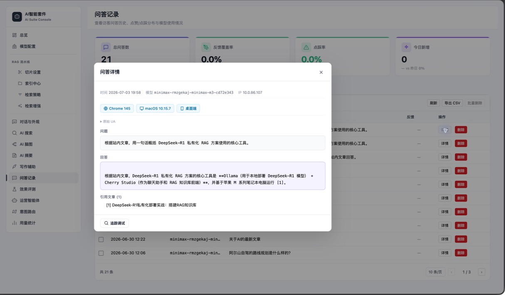
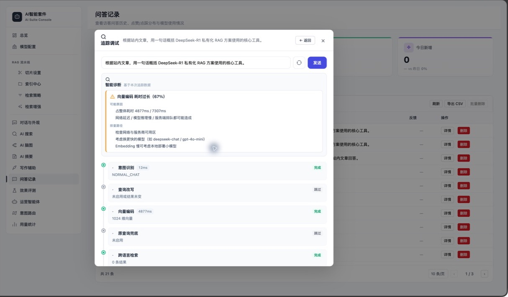
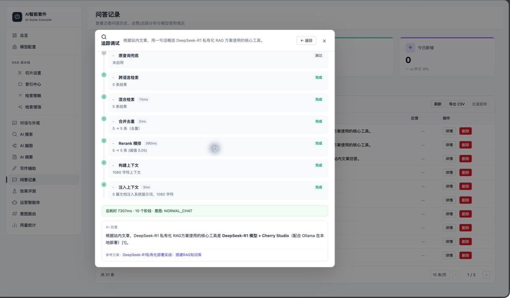

# 问答记录与反馈

> 适用读者：站长、质量分析和内容运营人员

问答记录保存问题、回答、模型、引用、反馈和必要的检索信息，用于定位失败回答和发现内容缺口。

## 页面能力

- 按时间、模型、问题和反馈类型筛选。
- 查看总问答数、反馈覆盖率、点踩率和今日新增。
- 打开单条问题、回答和引用详情。
- 查看点踩关联的检索 Trace。
- 删除单条或批量清理记录。

点击记录右侧的“详情”，可以查看问答时间、使用模型、客户端环境、完整问题与回答、引用文章，以及进入“追踪调试”的入口。

## Trace 回溯

回答完成时 Trace 临时保存在内存中；用户点踩时，Trace 会被补写进 ChatLog。未点踩 Trace 会在缓存过期后清理，因此不是所有历史回答都有完整链路。

在问答详情中点击“追踪调试”，可以用原问题重新执行一次完整问答链路。智能诊断会自动标出耗时占比异常的阶段，给出可能原因和排查路径；下方时间线则逐步展示意图识别、查询改写、向量编码、检索、合并去重、Rerank、上下文构建与注入结果。

继续向下可以核对每个阶段的输入输出数量、阈值、完成或跳过状态，并将总耗时、最终回答和引用文章放在同一条链路中对照。

状态为“跳过”不一定代表异常，通常表示对应增强能力未启用或没有改变当前结果；应优先关注“出错”“降级”，以及耗时明显偏高、候选数量骤降的阶段。

## 点踩分析顺序

1. 问题是否清楚。
2. 是否命中了错误意图。
3. 正确文章是否进入候选。
4. Rerank 是否过滤掉正确文章。
5. 上下文正确但模型回答是否偏离。
6. 站内是否本来就没有答案。

## 数据与隐私

- 问答可能包含访客输入和客户端信息，应按站点隐私政策管理。
- 删除记录不可恢复。
- 导出、截图或提交 Issue 前应脱敏。
- 运营智能体会读取近期问答日志，垃圾数据会影响分析结果。

## 运营闭环

点踩不一定代表模型差：它也可能说明文章过期、内容缺失、标题难检索或意图规则错误。将问题分类后，分别进入检索调优、Prompt 调整或内容生产流程。
