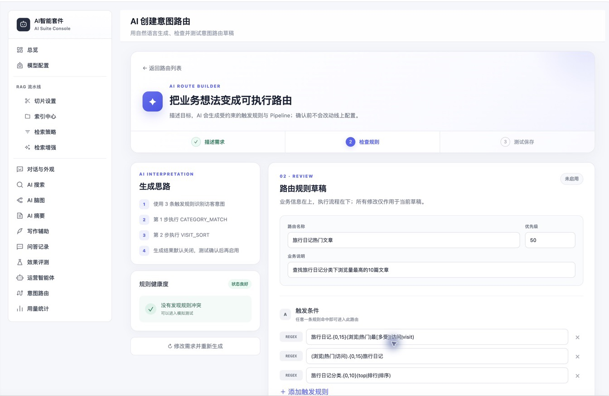
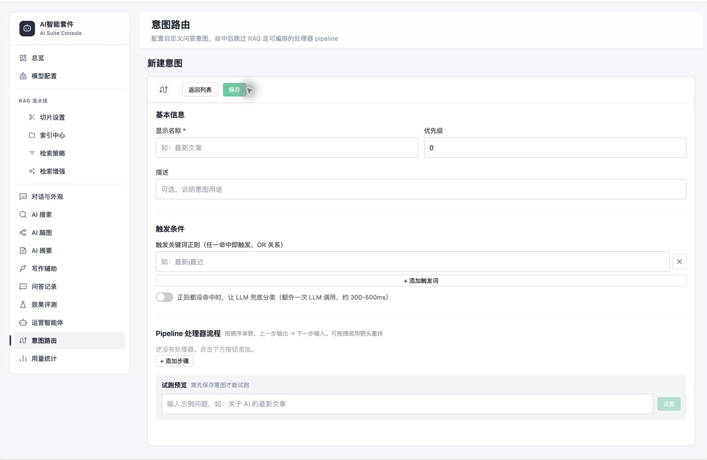

# 意图路由使用手册

> 适用读者：Halo 管理员、内容运营人员<br>
> 适用版本：AI 智能套件 0.3.2<br>
> 前置条件：插件已启用；使用 AI 创建、LLM 兜底或含 LLM 的处理器时，Chat 模型需可用

## 进入意图路由

打开 `Console → AI 智能套件 → 意图路由`。列表会显示路由名称、触发词、Pipeline、优先级、启用状态和更新时间。


页面提供两种创建入口：

- **AI 创建（推荐）**：用自然语言描述业务目标，由 AI 生成受约束的路由草稿，再检查和试跑。
- **手动创建**：直接配置触发规则与 Pipeline，适合熟悉处理器和参数的管理员。

两种入口最终保存的是同一种路由。新路由保存后默认关闭，需要在列表中确认结果后手动启用。

## 使用 AI 创建路由

在意图路由列表点击“AI 创建”，用自然语言描述希望实现的规则。创建工作区分为三步：

1. 描述需求：AI 会读取当前站点的标签、分类和已有路由。
2. 检查规则：查看生成思路、规则健康度、触发词和 Pipeline，并可直接修改草稿。
3. 测试并保存：使用未保存草稿真实执行 Pipeline，确认候选文章后保存。

AI 只生成现有处理器组成的结构化草稿，不生成或执行代码。生成结果始终默认关闭，且必须通过与手动创建相同的后端校验。模拟测试不会写入路由配置；包含 LLM 的处理器会产生模型调用和 Token 消耗。

### 第一步：描述需求

可以直接输入业务目标，也可以先选择右侧的灵感模板。描述中尽量写清主题或分类、排序方式和返回数量。


示例需求：

```text
查找旅行日记分类中浏览量最高的 10 篇文章。
```

预期 Pipeline：

```text
CATEGORY_MATCH(mode=fixed,categories=旅行日记)
→ VISIT_SORT(limit=10)
```

### 第二步：检查规则

生成完成后重点检查：

- 路由名称和业务说明是否准确；
- 正则是否既能命中目标问法，又不会过度匹配；
- 是否确实需要开启语义兜底分类；
- Pipeline 是否遵循“先筛选，再排序和限制数量”；
- 规则健康度是否提示与已有路由冲突。



### 第三步：测试并保存

输入一个访客可能提出的问题，运行测试后查看每个节点的输入数、输出数和真实文章结果。草稿试跑不会保存配置，也不会影响访客端；点击“保存为草稿”后，路由仍保持关闭。


## 使用手动创建

点击“手动创建”后，依次填写基本信息、触发条件和 Pipeline。处理器按从上到下的顺序执行，可拖拽或使用箭头重排。



注意：新路由需要先保存才能使用右侧试跑功能。编辑已保存路由时，可以输入示例问题，观察各阶段输入、输出数量和候选文章。

## 适用场景

意图路由适合需要读取站内实时文章数据、规则明确且可验证的问题：

- 最近发布了哪些 AI 文章？
- 哪些文章最热门？
- 给我看看 Java 标签下的文章。
- 列出某个分类中最新的十篇文章。

如果问题需要从文章正文中寻找知识答案，应该继续走 RAG，而不是为每个问题建立意图。

## 一次命中会发生什么

[](/diagrams/exported/intent-example-flow.svg)

## 路由字段

| 字段 | 作用 | 建议 |
| --- | --- | --- |
| 显示名称 | Console 中可读名称 | 用业务语言命名 |
| 描述 | 说明适用范围 | 写清包含和不包含什么 |
| 启用 | 是否参与检测 | 调试完成后再开启 |
| 优先级 | 多路由同时命中时的顺序 | 越具体的路由优先级越高 |
| 触发规则 | 正则表达式，任一命中即可 | 避免过宽的单字触发词 |
| LLM 兜底 | 正则未命中时允许模型分类 | 只对难以正则表达的场景开启 |
| Pipeline | 有序文章处理步骤 | 先过滤，再排序和限制数量 |

`outputTemplate` 仅作为旧路由和 API 数据的兼容字段保留，0.3.2 Console 不再提供配置入口，访客端也不会读取它来组织回答。

## 新建路由示例：Java 教程推荐

### 1. 基本信息

```text
显示名称: Java 教程推荐
优先级: 100
启用: 先关闭
```

### 2. 触发规则

```text
Java.*教程
学习.*Java
Java.*入门
```

触发规则是 OR 关系。表达式使用部分匹配，不需要手工在两端添加 `.*`，除非你确实要表达中间存在任意内容。

### 3. Pipeline

推荐步骤：

```text
TOPIC_MATCH
  prompt=判断文章是否属于 Java 教程或 Java 学习资料
  aliases=Java=JVM,JDK,Spring
  candidateLimit=200
  limit=30

TIME_SORT
  order=desc
  limit=10
```

### 4. 试跑并启用

在编辑页使用试跑功能，输入：

```text
我想系统学习 Java，有哪些教程？
```

检查每一步的输入、输出文章数和标题。结果正确后再开启路由。

## 访客端如何组织结果

意图命中后，服务端按固定规则返回导语、文章引用和 `structured_result`，访客端将真实候选文章渲染为统一彩色卡片。排序与数量完全由 Pipeline 决定，不会为了“润色回答”再调用一次大模型。

如果路由未命中、LLM 兜底失败或处理结果为空，请求会按当前问答流程回到 RAG，而不是返回虚构文章。

## 处理器参数

### TOPIC_MATCH

| 参数 | 含义 |
| --- | --- |
| `prompt` | 提供给主题判断的额外规则 |
| `aliases` | 主题别名，使用 `AI=人工智能`，多组用分号分隔 |
| `candidateLimit` | 进入 LLM 判断的候选上限 |
| `limit` | 输出文章上限 |
| `onFailure` | `empty`（默认）或 `keep` |

### LLM_TITLE_FILTER

纯粹根据标题让 LLM 返回相关序号。它看不到完整正文，适合标题表达清楚的文章集合。

| 参数 | 含义 |
| --- | --- |
| `prompt` | 主题判断说明 |
| `limit` | 输出上限 |
| `onFailure` | 失败策略 |

### TAG_MATCH / CATEGORY_MATCH

| 参数 | 含义 |
| --- | --- |
| `mode` | `from_query` 从问题提取；`fixed` 使用固定值 |
| `tags` / `categories` | 固定模式使用的名称 |
| `onFailure` | 失败策略 |

### KEYWORD_MATCH

| 参数 | 含义 |
| --- | --- |
| `mode` | 从查询或固定参数取关键词 |
| `fields` | `title` 或标题/内容组合 |
| `keyword` | 固定关键词 |

它做字符串包含，不做语义理解。同义词需求优先使用 TOPIC_MATCH。

### TIME_SORT

| 参数 | 含义 |
| --- | --- |
| `order` | `desc` 最新优先；`asc` 最早优先 |
| `limit` | 排序后保留数量 |

发布时间为空的文章会排在末尾。

### VISIT_SORT

`limit` 控制保留数量，浏览量来自 Halo Counter。

## 优先级设计

[](/diagrams/exported/intent-priority.svg)

如果两个路由都能匹配同一句话，只会返回排序后的第一个。优先级设计错误可能让通用意图“截胡”具体意图。

## LLM 兜底的成本与边界

只有正则全部未命中后，才会考虑 `llmFallback=true` 的候选。分类超时 2 秒，失败后自动回到 RAG。开启后会增加 `intent_detect` 模型调用，因此不要给所有路由无差别开启。

## 失败策略

处理器异常时默认输出空列表。这是为了避免过滤失败后把所有文章当成匹配结果。只有明确接受这种风险时才设置 `onFailure=keep`。

## 验证清单

- 目标问题能命中。
- 相似但不属于目标的问题不会误命中。
- 多路由冲突时优先级符合预期。
- 每一步输出数量合理。
- 导语、引用和结构化卡片只包含真实候选文章。
- 引用链接可以打开。
- 使用 LLM 兜底时能看到 `intent_detect` 用量；使用含 LLM 的处理器时能看到 `intent_pipeline` 用量。
- 仅使用标签、分类、关键词、时间或浏览量处理器时，不应为“组织回答”新增一次模型调用。

## 相关文档

- [意图路由架构](../architecture/intent-routing.md)
- [RAG 管线](../architecture/rag-pipeline.md)
- [故障排查](../operations/troubleshooting.md)
