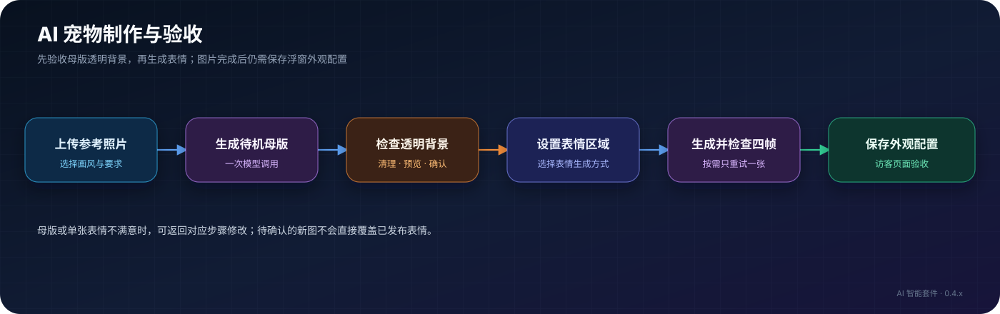
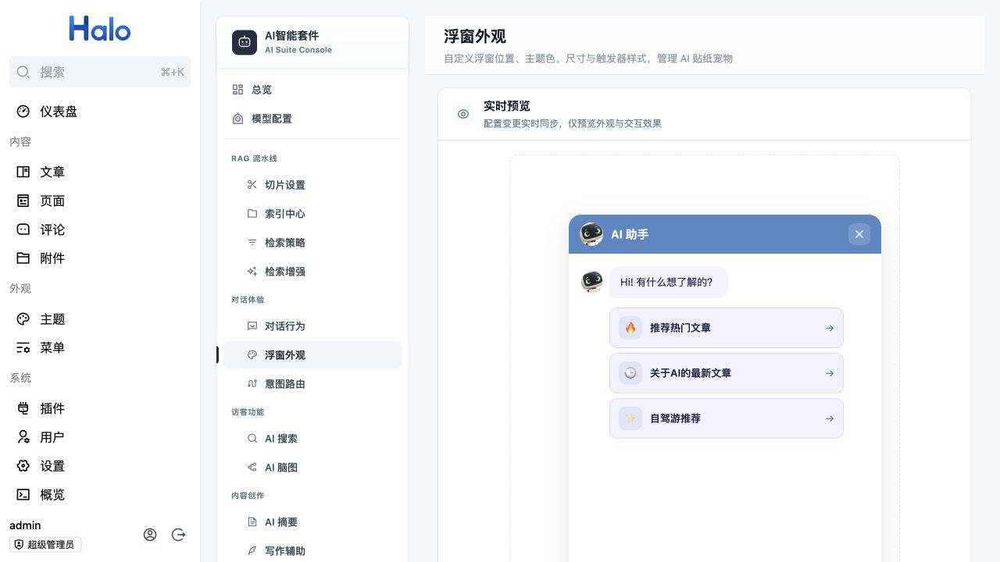
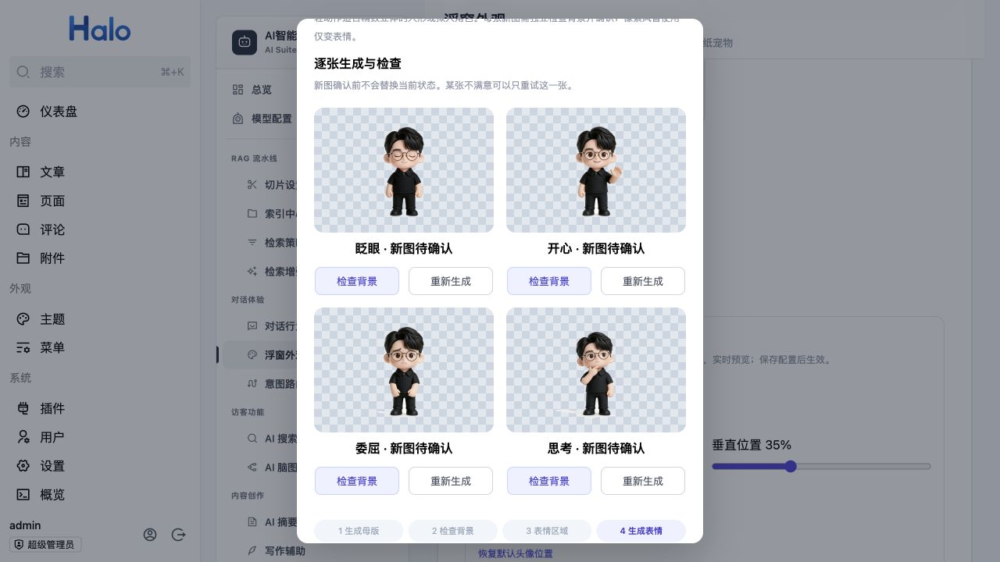
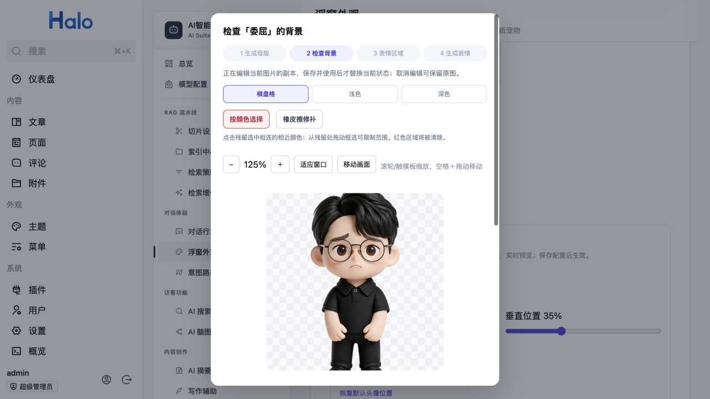
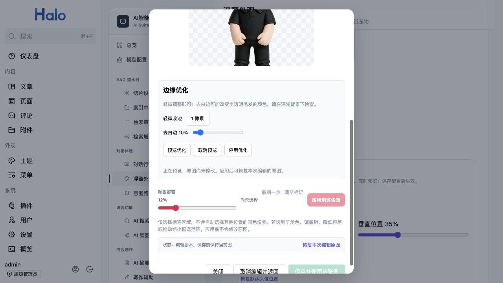

# 交互宠物与 AI 宠物制作

> 适用读者：Halo 站长、负责访客浮窗外观的管理员
>
> 适用版本：AI 智能套件 0.4.x、Halo 2.26+
>
> 预计耗时：选用内置皮肤约 2 分钟；制作 AI 宠物取决于生图模型响应时间
>
> 前置条件：插件已启用；制作 AI 宠物还需启用 AI Foundation 1.1.1+ 并配置图像生成模型

交互宠物是访客问答浮窗的入口形象。你可以直接选用内置皮肤，也可以用参考照片生成自己的宠物。0.3.x 文档对应的版本没有这套制作流程；升级前请先阅读[升级与迁移](../operations/upgrade-and-migration.md)。

## 直接使用内置皮肤

1. 打开 AI 智能套件 Console 的「浮窗外观」，将入口类型选为「交互宠物」。
2. 在「内置皮肤」中选择薄荷机器人、奶油橘猫或星云小精灵，按需要调整「宠物尺寸」。
3. 预览入口和聊天窗口，然后保存外观配置；在访客页面刷新检查实际位置、表情和聊天头像。

内置皮肤已有待机、眨眼、开心、委屈、思考五种状态，选用时**不调用生图模型**。如果旧配置仍引用已移除的皮肤，入口可能回退为静态图标；重新选择一款内置皮肤并保存即可。

*浮窗外观的实时预览：聊天标题与消息头像会随所选宠物更新。*

## 制作自己的 AI 宠物

先在「模型配置」中配置图像生成模型。制作弹窗会检查模型是否具备文生图和参考图生成能力；未配置或能力未就绪时会给出配置入口并禁用生成按钮。当前流程已用 Qwen Image 2.0 Pro、3.0 Pro 和豆包 Seedream 5 验证；其他模型可以尝试，但需单独检查生成质量和兼容性。模型检查通过也不代表额度、实际调用和图片质量一定正常。

1. 在「浮窗外观」选「交互宠物」，点击「我的宠物（AI 生成）」中的「上传照片生成」。上传 JPEG、PNG 或 WebP，文件不超过 5 MB。优先使用主体完整、轮廓清楚、与背景颜色有反差的照片；**不要求一定是浅色背景**。
2. 填写名称，选择「精致立体（推荐）」或「复古像素」。如需保留站姿、改变手势或限定材质，写在「母版补充要求」；可点「查看完整提示词」检查最终要求。
3. 点击「生成待机母版」。这一步先生成一张待机图，不会立即连续生成四种表情。界面显示任务阶段、已生成张数和已用时间；等待模型返回时没有可靠的百分比进度，不要重复提交。
4. 在「检查背景」中切换棋盘格、浅色和深色背景，重点检查脚底、轮廓、毛发和透明区域。需要时先清理，再点「确认背景并继续」。未确认母版背景时，不能生成表情或把新宠物用于访客入口。
5. 在「表情区域」拖动虚线椭圆覆盖眼睛、眉毛和嘴巴，调整宽、高及可用的边缘柔化。选择生成方式：默认「仅变表情」保持母版身体、轮廓和姿势；精致立体还可选「表情＋轻动作」，让部分表情带小幅手势，需逐张检查角色和脚底位置。复古像素暂不提供轻动作。
6. 可填写「表情补充要求」，确认调用费用后生成眨眼、开心、委屈和思考。默认「仅变表情」会在本地合成后保存四张图，应在结果页逐张查看；「表情＋轻动作」则先保存待确认候选图，每张需打开「检查背景」，满意时点「保存并使用这张图」。某张不满意，只对这一张点「重新生成」，不必重做另外三张。
7. 四张都验收后点「完成」。图片保存与外观配置保存是两件事：回到「浮窗外观」，选中这只宠物并**保存配置**，访客端才会使用它。最后在实际博客页面检查入口、聊天窗口和聊天头像。

*「表情＋轻动作」的逐张审核界面：每张候选图可独立检查背景或重新生成。*

## 清理阴影、白边和毛边

在母版或单张表情的「检查背景」页面操作。先放大到容易辨认的尺寸：滚轮或触摸板缩放、空格加拖动移动画面，也可使用「＋」「−」「适应窗口」。每次清理后，都在浅色和深色背景下再检查一遍。

*背景检查：先切换底色找残留，再放大并选择按颜色清理或橡皮擦。*

| 情况 | 建议操作 |
| --- | --- |
| 地面、白底或阴影是一块相连的近似颜色 | 用「按颜色选择」点击残留；必要时从残留处拖动框选限制范围，调整颜色容差。红色覆盖区就是将被清除的像素；若选中角色，撤销、降低容差或缩小框选范围。 |
| 残留很小，或紧贴角色轮廓 | 用「橡皮擦修补」逐段处理。圆形光标显示实际笔刷范围，避免碰到角色本体。 |
| 半透明边缘发白、显得不够立体 | 在「边缘优化」中先预览轻微收边或去白边，再决定是否「应用优化」。过强处理可能损失浅色毛发和透明材质；预览不会修改原图。 |
| 母版整体姿态或主体已不理想 | 修改母版补充要求后重新生成；新母版需要重新检查背景并生成表情。 |

*边缘优化：先预览，再决定是否应用；截图中的原图尚未修改。*

颜色选择和橡皮擦只有点「应用到母版」或「应用到这张图」后才会修改待审核图片；边缘优化也必须先预览、再显式应用。仍有未应用的标记或正在预览优化时，确认按钮会暂时不可用。复杂毛发、与角色同色的阴影和画进身体内部的光影，无法保证自动清理干净，需要人工检查；必要时重新生成原图。

## 已有宠物的维护

- 「我的宠物」卡片底部主按钮会按状态显示「检查背景」「生成表情」或「查看表情」。已确认的表情仍可通过「检查背景」重新编辑：系统先建立副本，只有点击「保存并使用这张图」才会替换当前状态；取消编辑保留原图。
- 卡片的「更多操作」中可「改名」或「删除」。改名只改名称，不调用模型，也不改变图片或当前选择。删除前会再次确认；删除后若还想使用，需要重新制作。
- 调整宠物头像位置或缩放后，也要保存外观配置才会在访客端生效。

## 常见问题与验收

| 现象 | 检查方式 |
| --- | --- |
| 「生成待机母版」不可点击 | 查看弹窗中的模型状态；去「模型配置」选择具备文生图和参考图能力的模型，测试连通性后点「重新检查」。 |
| 四张图身体姿势一样 | 「仅变表情」本来就保持母版姿势。需要小幅手势时，对精致立体宠物选「表情＋轻动作」，并逐张验收。 |
| 生成失败或新图不满意 | 查看实际错误信息；修改补充要求或只重试失败的那张。不要在等待模型时反复点击，避免重复费用。 |
| 后台已有图片，前台仍显示旧形象 | 确认母版和表情均已审核，再选中宠物、保存「浮窗外观」配置，并刷新访客页面。 |

上线前至少核对：入口在桌面和手机视口均不遮挡内容；待机、开心、思考等状态能正常显示；浅色与深色背景下没有明显白底、脚底阴影或毛边；聊天头像裁切合适。更详细的接口与实现约束见 [Console API](../api/console-api.md)和 [Widget 开发](../development/widget-development.md)。
