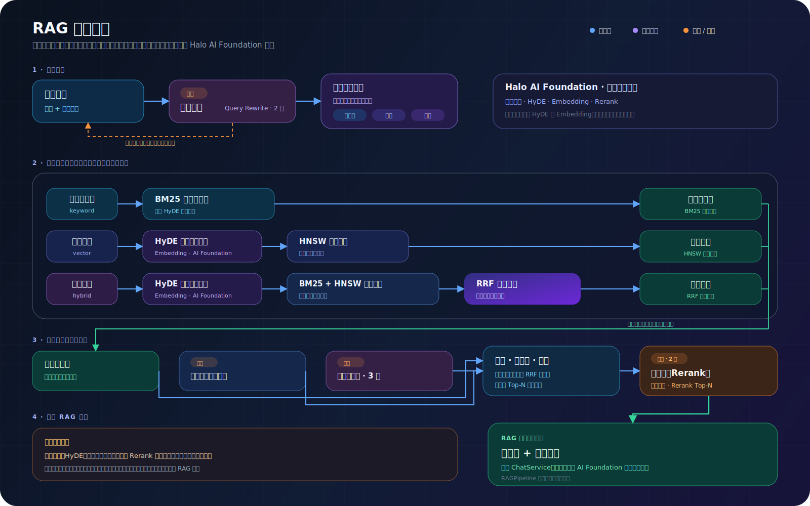

# 模型、切片与检索配置

> 适用读者：Halo 站长、RAG 调优人员  
> 建议顺序：模型 → 切片 → 检索 → 检索增强

## 四层配置关系

| 页面 | 决定什么 | 典型变更影响 |
| --- | --- | --- |
| 模型配置 | Chat、Embedding、Rerank、Query Rewrite 服务 | Embedding 变化需重建索引 |
| 切片设置 | 文章怎样拆成可检索片段 | 变化后需重建受影响文章 |
| 检索策略 | keyword/vector/hybrid、候选数和阈值 | 保存后对新请求生效 |
| 检索增强 | Rewrite、HyDE、Rerank、跨语言 | 增加效果、延迟和费用 |

## 推荐的首次配置

1. 配置 Chat 与 Embedding 模型并分别测试。
2. 保持默认切片：500 字符、50 字符重叠、标题与句子感知开启。
3. 使用 `hybrid`，`topK=20`、`topN=5`。
4. 完成全量索引并建立一组可验证问题。
5. 只有基础结果稳定后，再逐项开启增强能力。

## 切片怎样调

| 现象 | 调整方向 |
| --- | --- |
| 命中内容只有半句话 | 增大切片，保持句子感知 |
| 一个切片混入多个主题 | 减小切片，开启标题感知 |
| 相邻切片上下文断裂 | 增大重叠 |
| 索引成本和体积过高 | 增大切片或关闭自动关键词 |
| Markdown 长文结构明显 | 保持标题感知开启 |

切片参数的修改不会转换已有索引。完成修改后，在索引中心执行单篇或全量重建。

## 三种检索模式

- `keyword`：不需要 Embedding，适合专有名词和精确字符串。
- `vector`：只用语义向量；Embedding 缺失时没有检索结果。
- `hybrid`：推荐默认值；Embedding 缺失时可以降级到关键词检索。

## 调参顺序

先看 Trace 中正确文章是否被召回：

1. 未召回：增大 `topK` 或降低相似度阈值。
2. 已召回但没进入上下文：增大 `topN`。
3. 候选很多且排序不佳：启用 Rerank。
4. 多轮问题指代不清：启用 Query Rewrite，并保留原始查询。
5. 跨语言提问确实存在：再启用跨语言检索。

不要同时修改多个层级，否则无法判断是哪项配置带来变化。

## 成本与延迟

| 能力 | 新增调用 |
| --- | --- |
| Query Rewrite | 一次 Chat 调用 |
| HyDE | 一次 Chat + 一次 Embedding |
| 保留原查询 | 额外检索，混合模式可能额外 Embedding |
| 跨语言 | 翻译/改写与额外检索 |
| Rerank | 一次 Rerank 调用 |
| 自动关键词 | 建索引时的模型调用 |

## 验证

- 使用固定问题集记录修改前后结果。
- 同时观察正确文章排名、引用、回答质量、耗时和 token。
- 通过效果评测批量比较，不要只凭一个问题判断。

详细默认值见 [配置参考](../reference/configuration-reference.md)，底层流程见 [RAG 管线](../architecture/rag-pipeline.md)。
