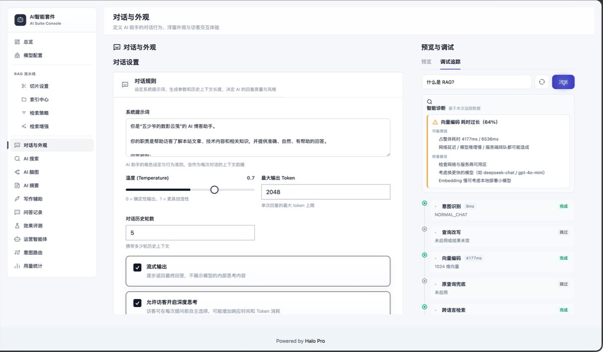
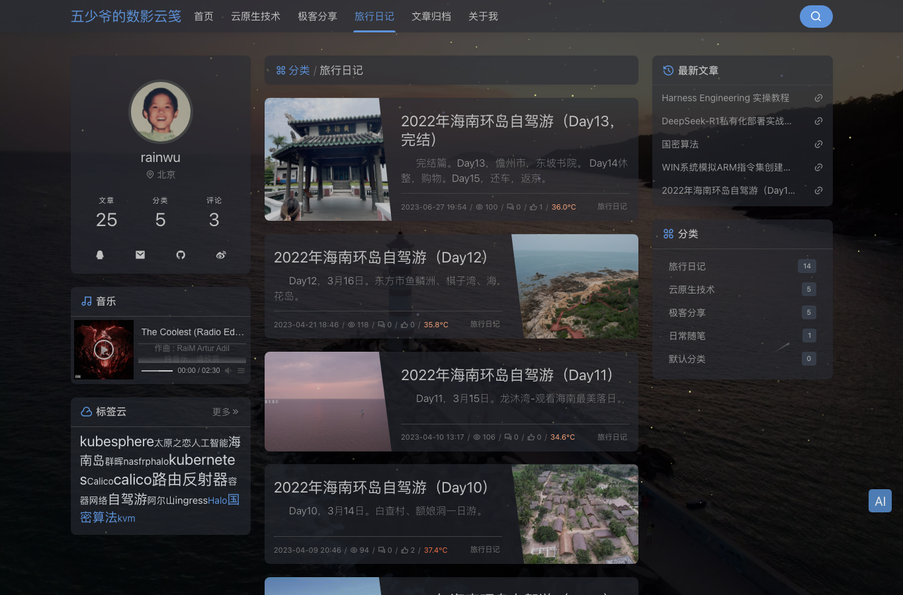
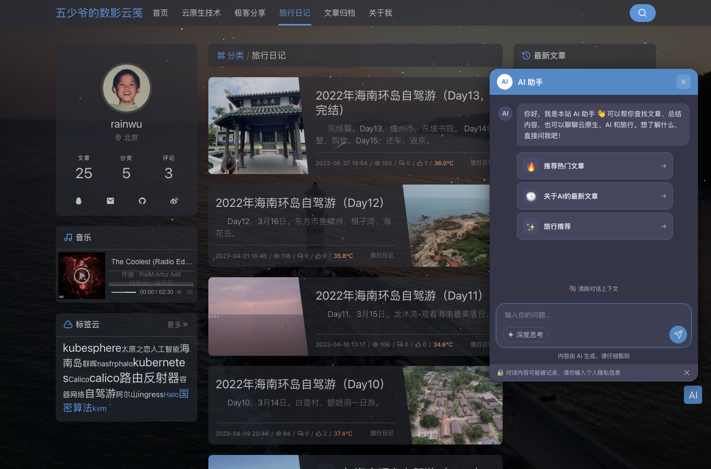

# 访客问答与浮窗

> 适用读者：Halo 站长、前台体验负责人

## 工作流程

快捷问题绑定 `intentRouteId` 时会直达指定路由，否则系统自动检测意图。意图路径直接返回确定性导语、引用和 `structured_result` 文章卡片，不为组织回答再次调用模型；未命中时进入 RAG，并通过 Halo AI Foundation 流式生成。两条路径最终共用 SSE、日志和反馈协议。

## 上线步骤

1. 在后台调试区完成一轮有引用的问答。
2. 设置 System Prompt、温度、最大输出和历史轮数。
3. 配置欢迎语与快捷问题。
4. 决定是否允许访客开启深度思考，以及默认状态。
5. 调整主题、尺寸、位置和触发按钮。
6. 根据隐私策略开启提示。
7. 开启访客使用，并在无痕窗口验证。

## 调试追踪

“预览与调试”区域切换到“调试追踪”后，可以输入测试问题并实时查看意图识别、查询改写、向量编码、检索、去重、Rerank、上下文构建和注入结果。顶部智能诊断会标出耗时占比异常的阶段，并给出可能原因与排查建议。

这里适合在调整 System Prompt、检索策略或增强能力后立即验证效果；“问答记录”中的追踪调试则更适合从一条历史问题出发复现故障。状态为“跳过”通常表示对应能力未启用或没有改变结果，不应直接判定为异常。

## 对话配置建议

- System Prompt 明确“优先依据站内文章，不确定时说明不知道”。
- 知识问答温度建议保持中低值，避免自由发挥。
- 历史轮数不是越多越好；过多历史会增加 token 并引入旧话题。
- 开启引用，让访客能够回到原文核实。
- 快捷问题建议保留 3-4 个，显示标题保持简短，“实际问题”写完整语义。
- 热门、最新、标签和分类入口建议绑定对应的已启用意图，避免修改文案后触发词失效。
- 保存前使用“试运行”在右侧预览中验证返回结果。
- 平台数据型意图使用确定性导语和结构化卡片，不为排版额外调用语言模型。
- 深度思考适合复杂比较和归纳，不建议作为所有简单问题的强制默认值；它可能增加首字延迟和 Token 消耗。

## 深度思考

允许访客选择后，输入区会显示深度思考开关。模型返回的推理过程进入独立折叠面板，最终回答仍在正常消息区域。不同模型的支持方式和降级行为见 [深度思考与推理过程](reasoning-mode.md)。

## 访客与隐私

关闭“允许游客使用”后，前端隐藏入口，后端也会拒绝匿名直接调用，避免绕过 UI 产生模型成本。开启问答记录时，应通过隐私提示告知访客内容可能被保存用于质量分析。

## 外观与主题

浮窗可以独立配置左右位置、主题色、窗口宽高、按钮图标、按钮文字、按钮尺寸、形状和水平边距。深浅色模式支持“自动适配博客”“跟随系统”“强制浅色”和“强制深色”。

按钮垂直位置建议优先使用“自动避让页面悬浮按钮”；只有与主题按钮发生冲突时，再改为手动指定距底像素。填写按钮文字后会优先显示文字，图标配置不再生效。

上线前应同时检查下面两种状态：入口按钮需要与主题已有悬浮控件保持间距；浮窗打开后不能遮挡主要导航和关键内容，并确认欢迎语、快捷问题、深度思考入口、隐私提示和主题颜色均与后台预览一致。

## 验证清单

- 未登录访客的可见性符合开关。
- 欢迎语和快捷问题正确。
- 回答逐步流式出现。
- 引用链接能够打开。
- 点赞/点踩能写入问答记录。
- Nginx/CDN 不缓冲 SSE。
- 深度思考开关、折叠面板和最终回答相互独立。
- `X-Forwarded-For` 能让限流识别真实 IP。

接口与事件格式见 [SSE 协议](../api/sse-protocol.md)，代理设置见 [生产部署](../operations/production-deployment.md)。
