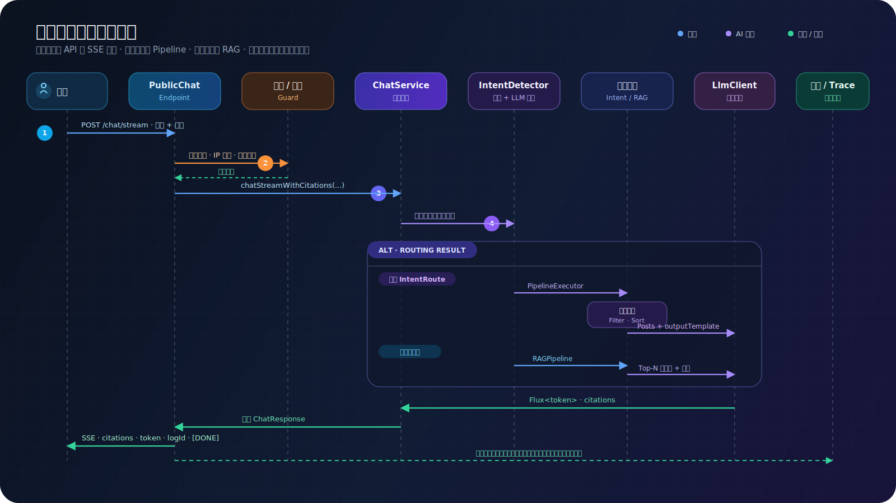

# 访客问答与浮窗

> 适用读者：Halo 站长、前台体验负责人

## 工作流程

访客问答会先检测意图；未命中时进入 RAG。两条路径最终都返回相同的 SSE、引用、日志和反馈结构。

## 上线步骤

1. 在后台调试区完成一轮有引用的问答。
2. 设置 System Prompt、温度、最大输出和历史轮数。
3. 配置欢迎语与快捷问题。
4. 调整主题、尺寸、位置和触发按钮。
5. 根据隐私策略开启提示。
6. 开启访客使用，并在无痕窗口验证。

## 对话配置建议

- System Prompt 明确“优先依据站内文章，不确定时说明不知道”。
- 知识问答温度建议保持中低值，避免自由发挥。
- 历史轮数不是越多越好；过多历史会增加 token 并引入旧话题。
- 开启引用，让访客能够回到原文核实。
- 快捷问题使用站内确实能够回答的问题。

## 访客与隐私

关闭“允许游客使用”后，前端隐藏入口，后端也会拒绝匿名直接调用，避免绕过 UI 产生模型成本。开启问答记录时，应通过隐私提示告知访客内容可能被保存用于质量分析。

## 外观与主题

浮窗可以独立配置深浅色、主题色、尺寸、按钮形状和偏移。移动端会尽量保留阅读上下文，不建议做强制全屏覆盖。

## 验证清单

- 未登录访客的可见性符合开关。
- 欢迎语和快捷问题正确。
- 回答逐步流式出现。
- 引用链接能够打开。
- 点赞/点踩能写入问答记录。
- Nginx/CDN 不缓冲 SSE。
- `X-Forwarded-For` 能让限流识别真实 IP。

接口与事件格式见 [SSE 协议](../api/sse-protocol.md)，代理设置见 [生产部署](../operations/production-deployment.md)。
