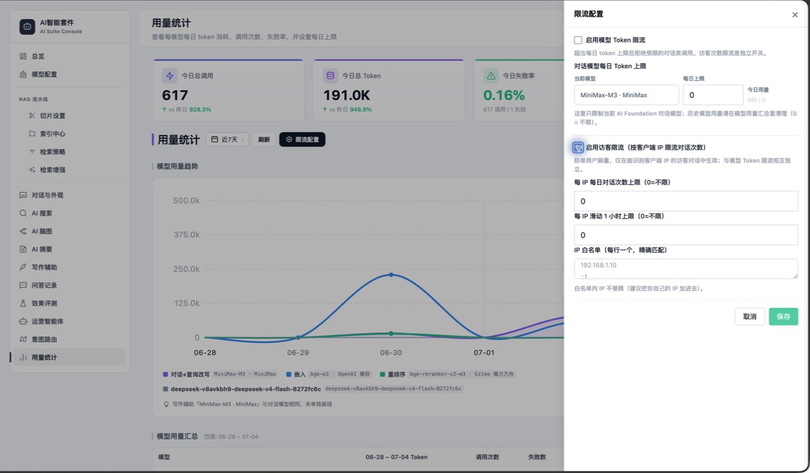
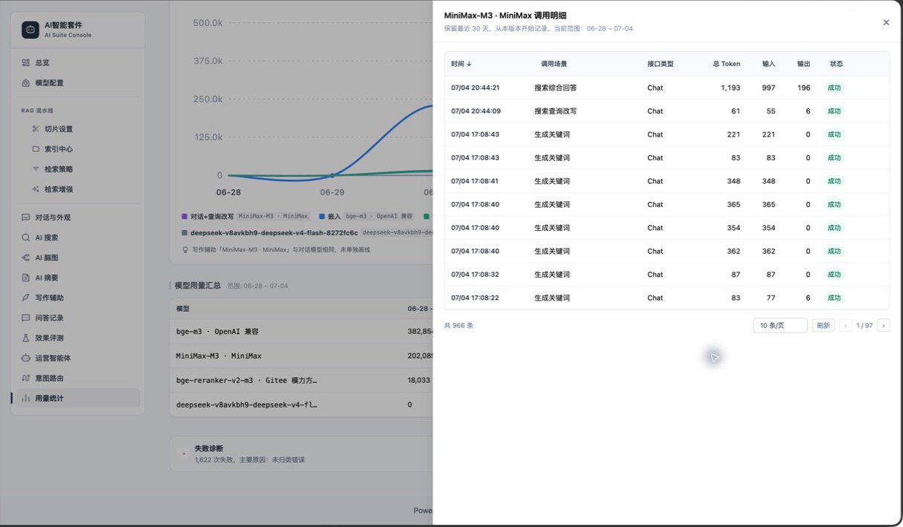

# 用量统计与限流

> 适用读者：站长、成本与安全负责人

用量页面展示调用次数、token、失败率、活跃模型、调用明细、失败诊断、模型清理和每日限额；访客限流按客户端 IP 控制小时和每日频率。

## 两类限制

| 类型 | 目的 | 维度 |
| --- | --- | --- |
| 模型每日 token 上限 | 控制预算 | 模型名称 + 日期 |
| 访客频率限制 | 防止滥用 | 客户端 IP + 小时/日期 |

模型限额采用预扣与调用后对账，降低并发请求同时穿透上限的风险。

点击页面右上角的“限流配置”，可以分别启用当前对话模型的每日 Token 上限和访客 IP 频率限制。两类限制相互独立；`0` 表示不限制。

## 配置建议

1. 先观察一周真实用量。
2. 给主要 Chat 模型设置高于正常峰值的每日上限。
3. 为匿名访客设置小时和每日限制。
4. 只给可信监控或办公出口配置白名单。
5. 验证 Nginx 正确传递 `X-Forwarded-For`。

如果所有访客都被识别为同一个代理 IP，限流会误伤整个站点。

## 调用场景

场景用于区分费用来源，例如访客问答、Embedding、Rerank、摘要、脑图、写作、评测和运营智能体。完整枚举见 [用量场景参考](../reference/usage-scenarios.md)。

## 失败诊断与模型清理

失败诊断会把调用明细中的失败记录按类型、场景和常见原因聚合，例如 Embedding 维度不匹配、Rerank 模型配置异常、供应商限流、模型超时或 AI Foundation 服务不可用。排障时先看诊断建议，再打开调用明细查看原始错误。

在“模型用量汇总”中点击某个模型的“详情”，可以按时间查看调用场景、接口类型、总 Token、输入/输出 Token 和调用状态。明细保留最近 30 天，并支持按调用场景和状态筛选。

模型清理用于维护历史统计口径：

- 隐藏模型：不删除历史数据，只让废弃模型不再干扰常用视图。
- 合并模型：模型资源重命名后，把旧名称的历史用量并入新名称。
- 删除模型：清理测试模型或误记数据；这是破坏性操作，生产环境应先备份。

## 排查

| 现象 | 检查 |
| --- | --- |
| 请求突然全部被拒绝 | 模型日限额、日期边界、失败重试 |
| 多个访客共享额度 | 代理头与真实 IP |
| token 为 0 | AI Foundation/供应商是否返回标准 usage |
| 调用数有但模型不对 | AI Foundation 模型资源名是否复用或改名 |
| 失败率升高 | 失败诊断、调用明细错误、AI Foundation 模型连通性、网络 |

## 安全提示

白名单等于绕过访客频率限制，不等于绕过模型总预算。不要把不受控的公网代理加入白名单。
